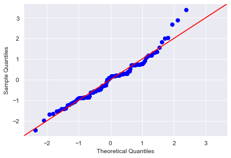
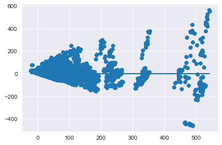
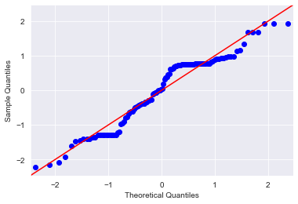
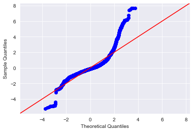
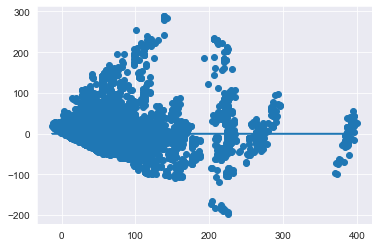
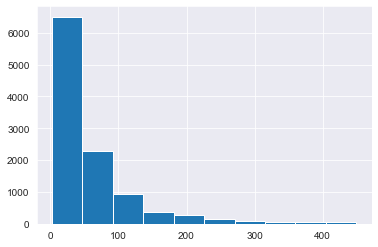
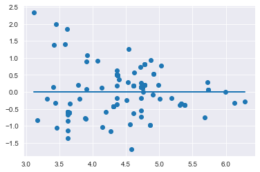
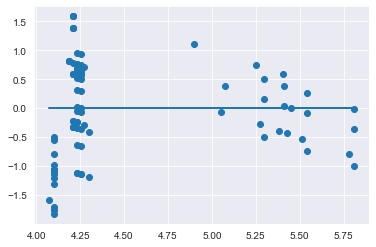

# Modeling Your Data - Lab

## Introduction 

In this lab you'll perform a full linear regression analysis on the data. You'll implement the process demonstrated in the previous lesson, taking a stepwise approach to analyze and improve the model along the way.

## Objectives
You will be able to:

* Perform a full linear regression with iterations based on p-value of features and other parameters
* Create visualizations to better understand the distributions of variables in a dataset
* Determine whether or not the assumptions for linear regression hold true for this example

## Build an Initial Regression Model

To start, load the data and create an initial regression model to model the `list_price` using all of your available features.

> **Note:** In order to write the model you'll have to do some tedious manipulation of your column names. Statsmodels will not allow you to have spaces, apostrophe or arithmetic symbols (+) in your column names. Preview them and refine them as you go.  
**If you receive an error such as "PatsyError: error tokenizing input (maybe an unclosed string?)", then you need to further preprocess your column names.**


```python
import pandas as pd
import matplotlib.pyplot as plt
import numpy as np
import seaborn as sns
sns.set_style('darkgrid')

from statsmodels.formula.api import ols
from statsmodels.stats.outliers_influence import variance_inflation_factor
import statsmodels.api as sm
import scipy.stats as stats

import warnings
warnings.simplefilter('ignore', FutureWarning)
warnings.simplefilter('ignore', RuntimeWarning)
warnings.simplefilter('ignore', UserWarning)
```


```python
# __SOLUTION__ 
import pandas as pd
import matplotlib.pyplot as plt
import numpy as np
import seaborn as sns
sns.set_style('darkgrid')

from statsmodels.formula.api import ols
from statsmodels.stats.outliers_influence import variance_inflation_factor
import statsmodels.api as sm
import scipy.stats as stats

import warnings
warnings.simplefilter('ignore', FutureWarning)
warnings.simplefilter('ignore', RuntimeWarning)
warnings.simplefilter('ignore', UserWarning)
```


```python
# Import the dataset 'Lego_dataset_cleaned.csv'
df = None
```


```python
# __SOLUTION__ 
df = pd.read_csv('Lego_dataset_cleaned.csv')
df.head()
```


<div>
<style scoped>
    .dataframe tbody tr th:only-of-type {
        vertical-align: middle;
    }

    .dataframe tbody tr th {
        vertical-align: top;
    }

    .dataframe thead th {
        text-align: right;
    }
</style>
<table border="1" class="dataframe">
  <thead>
    <tr style="text-align: right;">
      <th></th>
      <th>piece_count</th>
      <th>list_price</th>
      <th>num_reviews</th>
      <th>play_star_rating</th>
      <th>star_rating</th>
      <th>val_star_rating</th>
      <th>ages_10+</th>
      <th>ages_10-14</th>
      <th>ages_10-16</th>
      <th>ages_10-21</th>
      <th>...</th>
      <th>country_NZ</th>
      <th>country_PL</th>
      <th>country_PT</th>
      <th>country_US</th>
      <th>review_difficulty_Average</th>
      <th>review_difficulty_Challenging</th>
      <th>review_difficulty_Easy</th>
      <th>review_difficulty_Very Challenging</th>
      <th>review_difficulty_Very Easy</th>
      <th>review_difficulty_unknown</th>
    </tr>
  </thead>
  <tbody>
    <tr>
      <th>0</th>
      <td>-0.273020</td>
      <td>29.99</td>
      <td>-0.398512</td>
      <td>-0.655279</td>
      <td>-0.045687</td>
      <td>-0.365010</td>
      <td>0</td>
      <td>0</td>
      <td>0</td>
      <td>0</td>
      <td>...</td>
      <td>0</td>
      <td>0</td>
      <td>0</td>
      <td>1</td>
      <td>1</td>
      <td>0</td>
      <td>0</td>
      <td>0</td>
      <td>0</td>
      <td>0</td>
    </tr>
    <tr>
      <th>1</th>
      <td>-0.404154</td>
      <td>19.99</td>
      <td>-0.398512</td>
      <td>-0.655279</td>
      <td>0.990651</td>
      <td>-0.365010</td>
      <td>0</td>
      <td>0</td>
      <td>0</td>
      <td>0</td>
      <td>...</td>
      <td>0</td>
      <td>0</td>
      <td>0</td>
      <td>1</td>
      <td>0</td>
      <td>0</td>
      <td>1</td>
      <td>0</td>
      <td>0</td>
      <td>0</td>
    </tr>
    <tr>
      <th>2</th>
      <td>-0.517242</td>
      <td>12.99</td>
      <td>-0.147162</td>
      <td>-0.132473</td>
      <td>-0.460222</td>
      <td>-0.204063</td>
      <td>0</td>
      <td>0</td>
      <td>0</td>
      <td>0</td>
      <td>...</td>
      <td>0</td>
      <td>0</td>
      <td>0</td>
      <td>1</td>
      <td>0</td>
      <td>0</td>
      <td>1</td>
      <td>0</td>
      <td>0</td>
      <td>0</td>
    </tr>
    <tr>
      <th>3</th>
      <td>0.635296</td>
      <td>99.99</td>
      <td>0.187972</td>
      <td>-1.352353</td>
      <td>0.161581</td>
      <td>0.117830</td>
      <td>0</td>
      <td>0</td>
      <td>0</td>
      <td>0</td>
      <td>...</td>
      <td>0</td>
      <td>0</td>
      <td>0</td>
      <td>1</td>
      <td>1</td>
      <td>0</td>
      <td>0</td>
      <td>0</td>
      <td>0</td>
      <td>0</td>
    </tr>
    <tr>
      <th>4</th>
      <td>0.288812</td>
      <td>79.99</td>
      <td>-0.063378</td>
      <td>-2.049427</td>
      <td>0.161581</td>
      <td>-0.204063</td>
      <td>0</td>
      <td>0</td>
      <td>0</td>
      <td>0</td>
      <td>...</td>
      <td>0</td>
      <td>0</td>
      <td>0</td>
      <td>1</td>
      <td>0</td>
      <td>1</td>
      <td>0</td>
      <td>0</td>
      <td>0</td>
      <td>0</td>
    </tr>
  </tbody>
</table>
<p>5 rows × 103 columns</p>
</div>


```python
# Your code here - Manipulate column names
```


```python
# __SOLUTION__ 
subs = [(' ', '_'),('.',''),("'",""),('™', ''), ('®',''),
        ('+','plus'), ('½','half'), ('-','_')
       ]
def col_formatting(col):
    for old, new in subs:
        col = col.replace(old,new)
    return col
```


```python
# __SOLUTION__ 
df.columns = [col_formatting(col) for col in df.columns]
```


```python
# __SOLUTION__ 
list(df.columns)
```


    ['piece_count',
     'list_price',
     'num_reviews',
     'play_star_rating',
     'star_rating',
     'val_star_rating',
     'ages_10plus',
     'ages_10_14',
     'ages_10_16',
     'ages_10_21',
     'ages_11_16',
     'ages_12plus',
     'ages_12_16',
     'ages_14plus',
     'ages_16plus',
     'ages_1half_3',
     'ages_1half_5',
     'ages_2_5',
     'ages_4plus',
     'ages_4_7',
     'ages_4_99',
     'ages_5plus',
     'ages_5_12',
     'ages_5_8',
     'ages_6plus',
     'ages_6_12',
     'ages_6_14',
     'ages_7plus',
     'ages_7_12',
     'ages_7_14',
     'ages_8plus',
     'ages_8_12',
     'ages_8_14',
     'ages_9plus',
     'ages_9_12',
     'ages_9_14',
     'ages_9_16',
     'theme_name_Angry_Birds',
     'theme_name_Architecture',
     'theme_name_BOOST',
     'theme_name_Blues_Helicopter_Pursuit',
     'theme_name_BrickHeadz',
     'theme_name_Carnotaurus_Gyrosphere_Escape',
     'theme_name_City',
     'theme_name_Classic',
     'theme_name_Creator_3_in_1',
     'theme_name_Creator_Expert',
     'theme_name_DC_Comics_Super_Heroes',
     'theme_name_DC_Super_Hero_Girls',
     'theme_name_DIMENSIONS',
     'theme_name_DUPLO',
     'theme_name_Dilophosaurus_Outpost_Attack',
     'theme_name_Disney',
     'theme_name_Elves',
     'theme_name_Friends',
     'theme_name_Ghostbusters',
     'theme_name_Ideas',
     'theme_name_Indoraptor_Rampage_at_Lockwood_Estate',
     'theme_name_Juniors',
     'theme_name_Jurassic_Park_Velociraptor_Chase',
     'theme_name_MINDSTORMS',
     'theme_name_Marvel_Super_Heroes',
     'theme_name_Minecraft',
     'theme_name_Minifigures',
     'theme_name_NEXO_KNIGHTS',
     'theme_name_NINJAGO',
     'theme_name_Power_Functions',
     'theme_name_Pteranodon_Chase',
     'theme_name_SERIOUS_PLAY',
     'theme_name_Speed_Champions',
     'theme_name_Star_Wars',
     'theme_name_Stygimoloch_Breakout',
     'theme_name_T_rex_Transport',
     'theme_name_THE_LEGO_BATMAN_MOVIE',
     'theme_name_THE_LEGO_NINJAGO_MOVIE',
     'theme_name_Technic',
     'country_AT',
     'country_AU',
     'country_BE',
     'country_CA',
     'country_CH',
     'country_CZ',
     'country_DE',
     'country_DN',
     'country_ES',
     'country_FI',
     'country_FR',
     'country_GB',
     'country_IE',
     'country_IT',
     'country_LU',
     'country_NL',
     'country_NO',
     'country_NZ',
     'country_PL',
     'country_PT',
     'country_US',
     'review_difficulty_Average',
     'review_difficulty_Challenging',
     'review_difficulty_Easy',
     'review_difficulty_Very_Challenging',
     'review_difficulty_Very_Easy',
     'review_difficulty_unknown']


```python
# __SOLUTION__ 
df.info()
```

    <class 'pandas.core.frame.DataFrame'>
    RangeIndex: 10870 entries, 0 to 10869
    Columns: 103 entries, piece_count to review_difficulty_unknown
    dtypes: float64(6), int64(97)
    memory usage: 8.5 MB


```python
# Your code here - Define the target and predictors
```


```python
# __SOLUTION__ 
# Defining the problem
outcome = 'list_price'
x_cols = list(df.columns)
x_cols.remove(outcome)
```


```python
# Your code here - Fit the actual model
```


```python
# __SOLUTION__ 
# Fitting the actual model
predictors = '+'.join(x_cols)
formula = outcome + '~' + predictors
model = ols(formula=formula, data=df).fit()
model.summary()
```


<table class="simpletable">
<caption>OLS Regression Results</caption>
<tr>
  <th>Dep. Variable:</th>       <td>list_price</td>    <th>  R-squared:         </th> <td>   0.864</td> 
</tr>
<tr>
  <th>Model:</th>                   <td>OLS</td>       <th>  Adj. R-squared:    </th> <td>   0.862</td> 
</tr>
<tr>
  <th>Method:</th>             <td>Least Squares</td>  <th>  F-statistic:       </th> <td>   726.2</td> 
</tr>
<tr>
  <th>Date:</th>             <td>Wed, 24 Aug 2022</td> <th>  Prob (F-statistic):</th>  <td>  0.00</td>  
</tr>
<tr>
  <th>Time:</th>                 <td>18:13:07</td>     <th>  Log-Likelihood:    </th> <td> -54056.</td> 
</tr>
<tr>
  <th>No. Observations:</th>      <td> 10870</td>      <th>  AIC:               </th> <td>1.083e+05</td>
</tr>
<tr>
  <th>Df Residuals:</th>          <td> 10775</td>      <th>  BIC:               </th> <td>1.090e+05</td>
</tr>
<tr>
  <th>Df Model:</th>              <td>    94</td>      <th>                     </th>     <td> </td>    
</tr>
<tr>
  <th>Covariance Type:</th>      <td>nonrobust</td>    <th>                     </th>     <td> </td>    
</tr>
</table>
<table class="simpletable">
<tr>
                          <td></td>                            <th>coef</th>     <th>std err</th>      <th>t</th>      <th>P>|t|</th>  <th>[0.025</th>    <th>0.975]</th>  
</tr>
<tr>
  <th>Intercept</th>                                        <td>   64.2821</td> <td>    1.551</td> <td>   41.435</td> <td> 0.000</td> <td>   61.241</td> <td>   67.323</td>
</tr>
<tr>
  <th>piece_count</th>                                      <td>   75.7184</td> <td>    0.776</td> <td>   97.605</td> <td> 0.000</td> <td>   74.198</td> <td>   77.239</td>
</tr>
<tr>
  <th>num_reviews</th>                                      <td>    6.4270</td> <td>    0.590</td> <td>   10.888</td> <td> 0.000</td> <td>    5.270</td> <td>    7.584</td>
</tr>
<tr>
  <th>play_star_rating</th>                                 <td>    5.2682</td> <td>    0.542</td> <td>    9.717</td> <td> 0.000</td> <td>    4.205</td> <td>    6.331</td>
</tr>
<tr>
  <th>star_rating</th>                                      <td>   -1.4380</td> <td>    0.617</td> <td>   -2.331</td> <td> 0.020</td> <td>   -2.647</td> <td>   -0.229</td>
</tr>
<tr>
  <th>val_star_rating</th>                                  <td>   -8.5504</td> <td>    0.550</td> <td>  -15.545</td> <td> 0.000</td> <td>   -9.628</td> <td>   -7.472</td>
</tr>
<tr>
  <th>ages_10plus</th>                                      <td>  122.9923</td> <td>    5.753</td> <td>   21.378</td> <td> 0.000</td> <td>  111.715</td> <td>  134.270</td>
</tr>
<tr>
  <th>ages_10_14</th>                                       <td>  -23.1648</td> <td>    7.788</td> <td>   -2.975</td> <td> 0.003</td> <td>  -38.430</td> <td>   -7.899</td>
</tr>
<tr>
  <th>ages_10_16</th>                                       <td>  -11.7969</td> <td>    3.528</td> <td>   -3.343</td> <td> 0.001</td> <td>  -18.713</td> <td>   -4.881</td>
</tr>
<tr>
  <th>ages_10_21</th>                                       <td>   55.9674</td> <td>    6.415</td> <td>    8.725</td> <td> 0.000</td> <td>   43.393</td> <td>   68.542</td>
</tr>
<tr>
  <th>ages_11_16</th>                                       <td>  -18.2277</td> <td>    5.058</td> <td>   -3.604</td> <td> 0.000</td> <td>  -28.141</td> <td>   -8.314</td>
</tr>
<tr>
  <th>ages_12plus</th>                                      <td>   70.5837</td> <td>    4.828</td> <td>   14.619</td> <td> 0.000</td> <td>   61.119</td> <td>   80.048</td>
</tr>
<tr>
  <th>ages_12_16</th>                                       <td>  -57.4333</td> <td>    5.882</td> <td>   -9.765</td> <td> 0.000</td> <td>  -68.962</td> <td>  -45.904</td>
</tr>
<tr>
  <th>ages_14plus</th>                                      <td>   24.6493</td> <td>    3.579</td> <td>    6.887</td> <td> 0.000</td> <td>   17.634</td> <td>   31.665</td>
</tr>
<tr>
  <th>ages_16plus</th>                                      <td>   32.9512</td> <td>    5.251</td> <td>    6.275</td> <td> 0.000</td> <td>   22.658</td> <td>   43.245</td>
</tr>
<tr>
  <th>ages_1half_3</th>                                     <td>   -9.0486</td> <td>    2.087</td> <td>   -4.336</td> <td> 0.000</td> <td>  -13.139</td> <td>   -4.958</td>
</tr>
<tr>
  <th>ages_1half_5</th>                                     <td>   -4.1380</td> <td>    2.605</td> <td>   -1.588</td> <td> 0.112</td> <td>   -9.244</td> <td>    0.969</td>
</tr>
<tr>
  <th>ages_2_5</th>                                         <td>   14.9724</td> <td>    1.459</td> <td>   10.260</td> <td> 0.000</td> <td>   12.112</td> <td>   17.833</td>
</tr>
<tr>
  <th>ages_4plus</th>                                       <td>  -18.5801</td> <td>    5.504</td> <td>   -3.376</td> <td> 0.001</td> <td>  -29.370</td> <td>   -7.791</td>
</tr>
<tr>
  <th>ages_4_7</th>                                         <td>   -6.1664</td> <td>    2.909</td> <td>   -2.120</td> <td> 0.034</td> <td>  -11.868</td> <td>   -0.465</td>
</tr>
<tr>
  <th>ages_4_99</th>                                        <td>   -3.0337</td> <td>    3.138</td> <td>   -0.967</td> <td> 0.334</td> <td>   -9.185</td> <td>    3.118</td>
</tr>
<tr>
  <th>ages_5plus</th>                                       <td>   -9.6179</td> <td>    2.705</td> <td>   -3.556</td> <td> 0.000</td> <td>  -14.920</td> <td>   -4.316</td>
</tr>
<tr>
  <th>ages_5_12</th>                                        <td>  -34.9818</td> <td>    2.739</td> <td>  -12.771</td> <td> 0.000</td> <td>  -40.351</td> <td>  -29.613</td>
</tr>
<tr>
  <th>ages_5_8</th>                                         <td>    6.4648</td> <td>    5.248</td> <td>    1.232</td> <td> 0.218</td> <td>   -3.822</td> <td>   16.752</td>
</tr>
<tr>
  <th>ages_6plus</th>                                       <td>  -27.0254</td> <td>    4.920</td> <td>   -5.493</td> <td> 0.000</td> <td>  -36.670</td> <td>  -17.381</td>
</tr>
<tr>
  <th>ages_6_12</th>                                        <td>  -22.1977</td> <td>    2.133</td> <td>  -10.407</td> <td> 0.000</td> <td>  -26.379</td> <td>  -18.017</td>
</tr>
<tr>
  <th>ages_6_14</th>                                        <td>   -6.2869</td> <td>    3.433</td> <td>   -1.831</td> <td> 0.067</td> <td>  -13.016</td> <td>    0.442</td>
</tr>
<tr>
  <th>ages_7plus</th>                                       <td>   -9.8137</td> <td>   24.056</td> <td>   -0.408</td> <td> 0.683</td> <td>  -56.967</td> <td>   37.340</td>
</tr>
<tr>
  <th>ages_7_12</th>                                        <td>  -20.3409</td> <td>    2.409</td> <td>   -8.445</td> <td> 0.000</td> <td>  -25.062</td> <td>  -15.619</td>
</tr>
<tr>
  <th>ages_7_14</th>                                        <td>  -17.6139</td> <td>    2.104</td> <td>   -8.370</td> <td> 0.000</td> <td>  -21.739</td> <td>  -13.489</td>
</tr>
<tr>
  <th>ages_8plus</th>                                       <td>   12.8065</td> <td>    4.150</td> <td>    3.086</td> <td> 0.002</td> <td>    4.672</td> <td>   20.941</td>
</tr>
<tr>
  <th>ages_8_12</th>                                        <td>  -19.5872</td> <td>    2.824</td> <td>   -6.935</td> <td> 0.000</td> <td>  -25.124</td> <td>  -14.051</td>
</tr>
<tr>
  <th>ages_8_14</th>                                        <td>  -15.8024</td> <td>    2.019</td> <td>   -7.827</td> <td> 0.000</td> <td>  -19.760</td> <td>  -11.845</td>
</tr>
<tr>
  <th>ages_9plus</th>                                       <td>  102.5387</td> <td>    8.979</td> <td>   11.419</td> <td> 0.000</td> <td>   84.937</td> <td>  120.140</td>
</tr>
<tr>
  <th>ages_9_12</th>                                        <td>  -28.0314</td> <td>    5.738</td> <td>   -4.885</td> <td> 0.000</td> <td>  -39.279</td> <td>  -16.784</td>
</tr>
<tr>
  <th>ages_9_14</th>                                        <td>  -10.5692</td> <td>    2.373</td> <td>   -4.453</td> <td> 0.000</td> <td>  -15.221</td> <td>   -5.917</td>
</tr>
<tr>
  <th>ages_9_16</th>                                        <td>   -6.1862</td> <td>    4.729</td> <td>   -1.308</td> <td> 0.191</td> <td>  -15.456</td> <td>    3.083</td>
</tr>
<tr>
  <th>theme_name_Angry_Birds</th>                           <td>   12.4778</td> <td>   14.072</td> <td>    0.887</td> <td> 0.375</td> <td>  -15.105</td> <td>   40.061</td>
</tr>
<tr>
  <th>theme_name_Architecture</th>                          <td>  -88.9777</td> <td>    5.544</td> <td>  -16.049</td> <td> 0.000</td> <td>  -99.845</td> <td>  -78.110</td>
</tr>
<tr>
  <th>theme_name_BOOST</th>                                 <td>   86.1812</td> <td>    8.200</td> <td>   10.510</td> <td> 0.000</td> <td>   70.108</td> <td>  102.255</td>
</tr>
<tr>
  <th>theme_name_Blues_Helicopter_Pursuit</th>              <td>   23.7185</td> <td>    7.746</td> <td>    3.062</td> <td> 0.002</td> <td>    8.534</td> <td>   38.903</td>
</tr>
<tr>
  <th>theme_name_BrickHeadz</th>                            <td> -133.4697</td> <td>    6.194</td> <td>  -21.549</td> <td> 0.000</td> <td> -145.611</td> <td> -121.329</td>
</tr>
<tr>
  <th>theme_name_Carnotaurus_Gyrosphere_Escape</th>         <td>   49.4227</td> <td>    7.766</td> <td>    6.364</td> <td> 0.000</td> <td>   34.200</td> <td>   64.645</td>
</tr>
<tr>
  <th>theme_name_City</th>                                  <td>   21.9154</td> <td>    2.127</td> <td>   10.302</td> <td> 0.000</td> <td>   17.746</td> <td>   26.085</td>
</tr>
<tr>
  <th>theme_name_Classic</th>                               <td>  -21.6138</td> <td>    2.906</td> <td>   -7.437</td> <td> 0.000</td> <td>  -27.311</td> <td>  -15.917</td>
</tr>
<tr>
  <th>theme_name_Creator_3_in_1</th>                        <td>   -0.7152</td> <td>    2.267</td> <td>   -0.315</td> <td> 0.752</td> <td>   -5.159</td> <td>    3.729</td>
</tr>
<tr>
  <th>theme_name_Creator_Expert</th>                        <td> -121.3727</td> <td>    4.168</td> <td>  -29.121</td> <td> 0.000</td> <td> -129.543</td> <td> -113.203</td>
</tr>
<tr>
  <th>theme_name_DC_Comics_Super_Heroes</th>                <td>    9.0729</td> <td>    3.113</td> <td>    2.914</td> <td> 0.004</td> <td>    2.970</td> <td>   15.176</td>
</tr>
<tr>
  <th>theme_name_DC_Super_Hero_Girls</th>                   <td>   10.8899</td> <td>    8.790</td> <td>    1.239</td> <td> 0.215</td> <td>   -6.340</td> <td>   28.120</td>
</tr>
<tr>
  <th>theme_name_DIMENSIONS</th>                            <td>   14.8156</td> <td>    2.851</td> <td>    5.197</td> <td> 0.000</td> <td>    9.227</td> <td>   20.404</td>
</tr>
<tr>
  <th>theme_name_DUPLO</th>                                 <td>    1.7859</td> <td>    1.606</td> <td>    1.112</td> <td> 0.266</td> <td>   -1.362</td> <td>    4.934</td>
</tr>
<tr>
  <th>theme_name_Dilophosaurus_Outpost_Attack</th>          <td>   28.9488</td> <td>    7.799</td> <td>    3.712</td> <td> 0.000</td> <td>   13.662</td> <td>   44.236</td>
</tr>
<tr>
  <th>theme_name_Disney</th>                                <td>    9.4680</td> <td>    2.554</td> <td>    3.707</td> <td> 0.000</td> <td>    4.461</td> <td>   14.474</td>
</tr>
<tr>
  <th>theme_name_Elves</th>                                 <td>   -0.0456</td> <td>    3.155</td> <td>   -0.014</td> <td> 0.988</td> <td>   -6.229</td> <td>    6.138</td>
</tr>
<tr>
  <th>theme_name_Friends</th>                               <td>    1.9607</td> <td>    2.043</td> <td>    0.960</td> <td> 0.337</td> <td>   -2.045</td> <td>    5.966</td>
</tr>
<tr>
  <th>theme_name_Ghostbusters</th>                          <td>  -66.9314</td> <td>    7.818</td> <td>   -8.562</td> <td> 0.000</td> <td>  -82.255</td> <td>  -51.607</td>
</tr>
<tr>
  <th>theme_name_Ideas</th>                                 <td> -127.6862</td> <td>    5.182</td> <td>  -24.639</td> <td> 0.000</td> <td> -137.845</td> <td> -117.528</td>
</tr>
<tr>
  <th>theme_name_Indoraptor_Rampage_at_Lockwood_Estate</th> <td>   63.7077</td> <td>    7.959</td> <td>    8.004</td> <td> 0.000</td> <td>   48.106</td> <td>   79.310</td>
</tr>
<tr>
  <th>theme_name_Juniors</th>                               <td>    0.2984</td> <td>    2.765</td> <td>    0.108</td> <td> 0.914</td> <td>   -5.122</td> <td>    5.719</td>
</tr>
<tr>
  <th>theme_name_Jurassic_Park_Velociraptor_Chase</th>      <td>   15.4723</td> <td>    7.677</td> <td>    2.015</td> <td> 0.044</td> <td>    0.424</td> <td>   30.521</td>
</tr>
<tr>
  <th>theme_name_MINDSTORMS</th>                            <td>  -16.0967</td> <td>    6.073</td> <td>   -2.651</td> <td> 0.008</td> <td>  -28.001</td> <td>   -4.193</td>
</tr>
<tr>
  <th>theme_name_Marvel_Super_Heroes</th>                   <td>    9.6129</td> <td>    2.146</td> <td>    4.480</td> <td> 0.000</td> <td>    5.407</td> <td>   13.819</td>
</tr>
<tr>
  <th>theme_name_Minecraft</th>                             <td>  -18.5420</td> <td>    3.691</td> <td>   -5.023</td> <td> 0.000</td> <td>  -25.777</td> <td>  -11.307</td>
</tr>
<tr>
  <th>theme_name_Minifigures</th>                           <td>   -9.6179</td> <td>    2.705</td> <td>   -3.556</td> <td> 0.000</td> <td>  -14.920</td> <td>   -4.316</td>
</tr>
<tr>
  <th>theme_name_NEXO_KNIGHTS</th>                          <td>   -1.9416</td> <td>    2.909</td> <td>   -0.667</td> <td> 0.504</td> <td>   -7.643</td> <td>    3.760</td>
</tr>
<tr>
  <th>theme_name_NINJAGO</th>                               <td>  -10.1941</td> <td>    2.780</td> <td>   -3.668</td> <td> 0.000</td> <td>  -15.643</td> <td>   -4.746</td>
</tr>
<tr>
  <th>theme_name_Power_Functions</th>                       <td>   11.8302</td> <td>    8.894</td> <td>    1.330</td> <td> 0.183</td> <td>   -5.603</td> <td>   29.263</td>
</tr>
<tr>
  <th>theme_name_Pteranodon_Chase</th>                      <td>   -0.0906</td> <td>    7.836</td> <td>   -0.012</td> <td> 0.991</td> <td>  -15.451</td> <td>   15.270</td>
</tr>
<tr>
  <th>theme_name_SERIOUS_PLAY</th>                          <td>  246.4357</td> <td>    6.530</td> <td>   37.740</td> <td> 0.000</td> <td>  233.636</td> <td>  259.235</td>
</tr>
<tr>
  <th>theme_name_Speed_Champions</th>                       <td>    4.4464</td> <td>    2.750</td> <td>    1.617</td> <td> 0.106</td> <td>   -0.944</td> <td>    9.837</td>
</tr>
<tr>
  <th>theme_name_Star_Wars</th>                             <td>   16.3728</td> <td>    1.565</td> <td>   10.460</td> <td> 0.000</td> <td>   13.305</td> <td>   19.441</td>
</tr>
<tr>
  <th>theme_name_Stygimoloch_Breakout</th>                  <td>   19.8584</td> <td>    7.676</td> <td>    2.587</td> <td> 0.010</td> <td>    4.813</td> <td>   34.904</td>
</tr>
<tr>
  <th>theme_name_T_rex_Transport</th>                       <td>   33.1561</td> <td>    7.753</td> <td>    4.276</td> <td> 0.000</td> <td>   17.958</td> <td>   48.354</td>
</tr>
<tr>
  <th>theme_name_THE_LEGO_BATMAN_MOVIE</th>                 <td>    5.7661</td> <td>    2.202</td> <td>    2.618</td> <td> 0.009</td> <td>    1.449</td> <td>   10.083</td>
</tr>
<tr>
  <th>theme_name_THE_LEGO_NINJAGO_MOVIE</th>                <td>  -15.9871</td> <td>    2.328</td> <td>   -6.869</td> <td> 0.000</td> <td>  -20.550</td> <td>  -11.425</td>
</tr>
<tr>
  <th>theme_name_Technic</th>                               <td>   -0.0498</td> <td>    2.479</td> <td>   -0.020</td> <td> 0.984</td> <td>   -4.909</td> <td>    4.809</td>
</tr>
<tr>
  <th>country_AT</th>                                       <td>    1.2678</td> <td>    1.521</td> <td>    0.833</td> <td> 0.405</td> <td>   -1.714</td> <td>    4.250</td>
</tr>
<tr>
  <th>country_AU</th>                                       <td>   -1.1405</td> <td>    1.525</td> <td>   -0.748</td> <td> 0.455</td> <td>   -4.130</td> <td>    1.849</td>
</tr>
<tr>
  <th>country_BE</th>                                       <td>    5.8481</td> <td>    1.532</td> <td>    3.817</td> <td> 0.000</td> <td>    2.845</td> <td>    8.851</td>
</tr>
<tr>
  <th>country_CA</th>                                       <td>   -9.7446</td> <td>    1.299</td> <td>   -7.503</td> <td> 0.000</td> <td>  -12.291</td> <td>   -7.199</td>
</tr>
<tr>
  <th>country_CH</th>                                       <td>    1.1374</td> <td>    1.527</td> <td>    0.745</td> <td> 0.456</td> <td>   -1.856</td> <td>    4.131</td>
</tr>
<tr>
  <th>country_CZ</th>                                       <td>    7.8635</td> <td>    1.554</td> <td>    5.061</td> <td> 0.000</td> <td>    4.818</td> <td>   10.909</td>
</tr>
<tr>
  <th>country_DE</th>                                       <td>    4.7053</td> <td>    1.553</td> <td>    3.029</td> <td> 0.002</td> <td>    1.660</td> <td>    7.750</td>
</tr>
<tr>
  <th>country_DN</th>                                       <td>   -8.2317</td> <td>    1.521</td> <td>   -5.411</td> <td> 0.000</td> <td>  -11.214</td> <td>   -5.250</td>
</tr>
<tr>
  <th>country_ES</th>                                       <td>    4.7053</td> <td>    1.553</td> <td>    3.029</td> <td> 0.002</td> <td>    1.660</td> <td>    7.750</td>
</tr>
<tr>
  <th>country_FI</th>                                       <td>   13.4911</td> <td>    1.554</td> <td>    8.684</td> <td> 0.000</td> <td>   10.446</td> <td>   16.536</td>
</tr>
<tr>
  <th>country_FR</th>                                       <td>    3.6654</td> <td>    1.529</td> <td>    2.397</td> <td> 0.017</td> <td>    0.668</td> <td>    6.663</td>
</tr>
<tr>
  <th>country_GB</th>                                       <td>    2.3410</td> <td>    1.520</td> <td>    1.540</td> <td> 0.124</td> <td>   -0.638</td> <td>    5.320</td>
</tr>
<tr>
  <th>country_IE</th>                                       <td>    1.8771</td> <td>    1.526</td> <td>    1.230</td> <td> 0.219</td> <td>   -1.114</td> <td>    4.868</td>
</tr>
<tr>
  <th>country_IT</th>                                       <td>    2.2320</td> <td>    1.552</td> <td>    1.438</td> <td> 0.150</td> <td>   -0.810</td> <td>    5.274</td>
</tr>
<tr>
  <th>country_LU</th>                                       <td>    5.9891</td> <td>    1.554</td> <td>    3.855</td> <td> 0.000</td> <td>    2.944</td> <td>    9.034</td>
</tr>
<tr>
  <th>country_NL</th>                                       <td>    5.8015</td> <td>    1.520</td> <td>    3.817</td> <td> 0.000</td> <td>    2.822</td> <td>    8.781</td>
</tr>
<tr>
  <th>country_NO</th>                                       <td>   12.6618</td> <td>    1.554</td> <td>    8.150</td> <td> 0.000</td> <td>    9.616</td> <td>   15.707</td>
</tr>
<tr>
  <th>country_NZ</th>                                       <td>    6.2245</td> <td>    1.530</td> <td>    4.070</td> <td> 0.000</td> <td>    3.226</td> <td>    9.223</td>
</tr>
<tr>
  <th>country_PL</th>                                       <td>    6.3455</td> <td>    1.579</td> <td>    4.019</td> <td> 0.000</td> <td>    3.251</td> <td>    9.440</td>
</tr>
<tr>
  <th>country_PT</th>                                       <td>    4.5545</td> <td>    1.557</td> <td>    2.926</td> <td> 0.003</td> <td>    1.503</td> <td>    7.606</td>
</tr>
<tr>
  <th>country_US</th>                                       <td>   -7.3120</td> <td>    1.297</td> <td>   -5.637</td> <td> 0.000</td> <td>   -9.855</td> <td>   -4.769</td>
</tr>
<tr>
  <th>review_difficulty_Average</th>                        <td>   15.7085</td> <td>    1.454</td> <td>   10.805</td> <td> 0.000</td> <td>   12.859</td> <td>   18.558</td>
</tr>
<tr>
  <th>review_difficulty_Challenging</th>                    <td>   18.8392</td> <td>    1.861</td> <td>   10.123</td> <td> 0.000</td> <td>   15.191</td> <td>   22.487</td>
</tr>
<tr>
  <th>review_difficulty_Easy</th>                           <td>    3.0365</td> <td>    1.458</td> <td>    2.083</td> <td> 0.037</td> <td>    0.179</td> <td>    5.894</td>
</tr>
<tr>
  <th>review_difficulty_Very_Challenging</th>               <td>   22.1477</td> <td>    7.215</td> <td>    3.070</td> <td> 0.002</td> <td>    8.005</td> <td>   36.290</td>
</tr>
<tr>
  <th>review_difficulty_Very_Easy</th>                      <td>    1.6501</td> <td>    1.778</td> <td>    0.928</td> <td> 0.354</td> <td>   -1.836</td> <td>    5.136</td>
</tr>
<tr>
  <th>review_difficulty_unknown</th>                        <td>    2.9000</td> <td>    1.599</td> <td>    1.814</td> <td> 0.070</td> <td>   -0.234</td> <td>    6.034</td>
</tr>
</table>
<table class="simpletable">
<tr>
  <th>Omnibus:</th>       <td>5896.308</td> <th>  Durbin-Watson:     </th>  <td>   1.468</td> 
</tr>
<tr>
  <th>Prob(Omnibus):</th>  <td> 0.000</td>  <th>  Jarque-Bera (JB):  </th> <td>606905.535</td>
</tr>
<tr>
  <th>Skew:</th>           <td> 1.674</td>  <th>  Prob(JB):          </th>  <td>    0.00</td> 
</tr>
<tr>
  <th>Kurtosis:</th>       <td>39.453</td>  <th>  Cond. No.          </th>  <td>2.27e+16</td> 
</tr>
</table><br/><br/>Notes:<br/>[1] Standard Errors assume that the covariance matrix of the errors is correctly specified.<br/>[2] The smallest eigenvalue is 4.71e-29. This might indicate that there are<br/>strong multicollinearity problems or that the design matrix is singular.


## Remove the Uninfluential Features

Based on the initial model, remove those features which do not appear to be statistically relevant and rerun the model.


```python
# Your code here - Remove features which do not appear to be statistically relevant
```


```python
# __SOLUTION__
# Subset pvalues result to only those less than .05
low_pvalues = model.pvalues[model.pvalues < 0.05]

# "Intercept" may be a low p-value but is not a valid column for the formula
low_pvalues.drop("Intercept", axis=0, errors="ignore", inplace=True)
low_pvalues
```


    piece_count                           0.000000e+00
    num_reviews                           1.819804e-27
    play_star_rating                      3.160824e-22
    star_rating                           1.978538e-02
    val_star_rating                       6.565959e-54
                                              ...     
    country_US                            1.773072e-08
    review_difficulty_Average             4.491864e-27
    review_difficulty_Challenging         5.588075e-24
    review_difficulty_Easy                3.730231e-02
    review_difficulty_Very_Challenging    2.147521e-03
    Length: 76, dtype: float64


```python
# __SOLUTION__
# Update the value of x_cols to match the index of that series
x_cols = low_pvalues.index.values
x_cols
```


    array(['piece_count', 'num_reviews', 'play_star_rating', 'star_rating',
           'val_star_rating', 'ages_10plus', 'ages_10_14', 'ages_10_16',
           'ages_10_21', 'ages_11_16', 'ages_12plus', 'ages_12_16',
           'ages_14plus', 'ages_16plus', 'ages_1half_3', 'ages_2_5',
           'ages_4plus', 'ages_4_7', 'ages_5plus', 'ages_5_12', 'ages_6plus',
           'ages_6_12', 'ages_7_12', 'ages_7_14', 'ages_8plus', 'ages_8_12',
           'ages_8_14', 'ages_9plus', 'ages_9_12', 'ages_9_14',
           'theme_name_Architecture', 'theme_name_BOOST',
           'theme_name_Blues_Helicopter_Pursuit', 'theme_name_BrickHeadz',
           'theme_name_Carnotaurus_Gyrosphere_Escape', 'theme_name_City',
           'theme_name_Classic', 'theme_name_Creator_Expert',
           'theme_name_DC_Comics_Super_Heroes', 'theme_name_DIMENSIONS',
           'theme_name_Dilophosaurus_Outpost_Attack', 'theme_name_Disney',
           'theme_name_Ghostbusters', 'theme_name_Ideas',
           'theme_name_Indoraptor_Rampage_at_Lockwood_Estate',
           'theme_name_Jurassic_Park_Velociraptor_Chase',
           'theme_name_MINDSTORMS', 'theme_name_Marvel_Super_Heroes',
           'theme_name_Minecraft', 'theme_name_Minifigures',
           'theme_name_NINJAGO', 'theme_name_SERIOUS_PLAY',
           'theme_name_Star_Wars', 'theme_name_Stygimoloch_Breakout',
           'theme_name_T_rex_Transport', 'theme_name_THE_LEGO_BATMAN_MOVIE',
           'theme_name_THE_LEGO_NINJAGO_MOVIE', 'country_BE', 'country_CA',
           'country_CZ', 'country_DE', 'country_DN', 'country_ES',
           'country_FI', 'country_FR', 'country_LU', 'country_NL',
           'country_NO', 'country_NZ', 'country_PL', 'country_PT',
           'country_US', 'review_difficulty_Average',
           'review_difficulty_Challenging', 'review_difficulty_Easy',
           'review_difficulty_Very_Challenging'], dtype=object)


```python
# Your code here - Refit the model
```


```python
# __SOLUTION__ 
# Refit model with subset features
predictors = '+'.join(x_cols)
formula = outcome + '~' + predictors
model = ols(formula=formula, data=df).fit()
model.summary()
```


<table class="simpletable">
<caption>OLS Regression Results</caption>
<tr>
  <th>Dep. Variable:</th>       <td>list_price</td>    <th>  R-squared:         </th> <td>   0.863</td> 
</tr>
<tr>
  <th>Model:</th>                   <td>OLS</td>       <th>  Adj. R-squared:    </th> <td>   0.863</td> 
</tr>
<tr>
  <th>Method:</th>             <td>Least Squares</td>  <th>  F-statistic:       </th> <td>   910.4</td> 
</tr>
<tr>
  <th>Date:</th>             <td>Wed, 24 Aug 2022</td> <th>  Prob (F-statistic):</th>  <td>  0.00</td>  
</tr>
<tr>
  <th>Time:</th>                 <td>18:13:18</td>     <th>  Log-Likelihood:    </th> <td> -54063.</td> 
</tr>
<tr>
  <th>No. Observations:</th>      <td> 10870</td>      <th>  AIC:               </th> <td>1.083e+05</td>
</tr>
<tr>
  <th>Df Residuals:</th>          <td> 10794</td>      <th>  BIC:               </th> <td>1.088e+05</td>
</tr>
<tr>
  <th>Df Model:</th>              <td>    75</td>      <th>                     </th>     <td> </td>    
</tr>
<tr>
  <th>Covariance Type:</th>      <td>nonrobust</td>    <th>                     </th>     <td> </td>    
</tr>
</table>
<table class="simpletable">
<tr>
                          <td></td>                            <th>coef</th>     <th>std err</th>      <th>t</th>      <th>P>|t|</th>  <th>[0.025</th>    <th>0.975]</th>  
</tr>
<tr>
  <th>Intercept</th>                                        <td>   64.7562</td> <td>    2.106</td> <td>   30.747</td> <td> 0.000</td> <td>   60.628</td> <td>   68.884</td>
</tr>
<tr>
  <th>piece_count</th>                                      <td>   75.7688</td> <td>    0.763</td> <td>   99.312</td> <td> 0.000</td> <td>   74.273</td> <td>   77.264</td>
</tr>
<tr>
  <th>num_reviews</th>                                      <td>    6.5022</td> <td>    0.585</td> <td>   11.111</td> <td> 0.000</td> <td>    5.355</td> <td>    7.649</td>
</tr>
<tr>
  <th>play_star_rating</th>                                 <td>    5.4112</td> <td>    0.531</td> <td>   10.190</td> <td> 0.000</td> <td>    4.370</td> <td>    6.452</td>
</tr>
<tr>
  <th>star_rating</th>                                      <td>   -1.4588</td> <td>    0.606</td> <td>   -2.406</td> <td> 0.016</td> <td>   -2.647</td> <td>   -0.271</td>
</tr>
<tr>
  <th>val_star_rating</th>                                  <td>   -8.4947</td> <td>    0.528</td> <td>  -16.084</td> <td> 0.000</td> <td>   -9.530</td> <td>   -7.459</td>
</tr>
<tr>
  <th>ages_10plus</th>                                      <td>  128.2005</td> <td>    6.586</td> <td>   19.465</td> <td> 0.000</td> <td>  115.291</td> <td>  141.110</td>
</tr>
<tr>
  <th>ages_10_14</th>                                       <td>  -19.3577</td> <td>    8.201</td> <td>   -2.360</td> <td> 0.018</td> <td>  -35.434</td> <td>   -3.281</td>
</tr>
<tr>
  <th>ages_10_16</th>                                       <td>   -8.7326</td> <td>    3.680</td> <td>   -2.373</td> <td> 0.018</td> <td>  -15.947</td> <td>   -1.519</td>
</tr>
<tr>
  <th>ages_10_21</th>                                       <td>   61.6708</td> <td>    7.062</td> <td>    8.733</td> <td> 0.000</td> <td>   47.829</td> <td>   75.513</td>
</tr>
<tr>
  <th>ages_11_16</th>                                       <td>  -15.5409</td> <td>    5.126</td> <td>   -3.032</td> <td> 0.002</td> <td>  -25.590</td> <td>   -5.492</td>
</tr>
<tr>
  <th>ages_12plus</th>                                      <td>   75.0700</td> <td>    5.737</td> <td>   13.085</td> <td> 0.000</td> <td>   63.824</td> <td>   86.316</td>
</tr>
<tr>
  <th>ages_12_16</th>                                       <td>  -54.0781</td> <td>    6.335</td> <td>   -8.536</td> <td> 0.000</td> <td>  -66.496</td> <td>  -41.660</td>
</tr>
<tr>
  <th>ages_14plus</th>                                      <td>   28.5356</td> <td>    4.315</td> <td>    6.613</td> <td> 0.000</td> <td>   20.078</td> <td>   36.993</td>
</tr>
<tr>
  <th>ages_16plus</th>                                      <td>   36.2814</td> <td>    6.010</td> <td>    6.037</td> <td> 0.000</td> <td>   24.501</td> <td>   48.061</td>
</tr>
<tr>
  <th>ages_1half_3</th>                                     <td>   -3.6613</td> <td>    3.116</td> <td>   -1.175</td> <td> 0.240</td> <td>   -9.769</td> <td>    2.446</td>
</tr>
<tr>
  <th>ages_2_5</th>                                         <td>   20.0271</td> <td>    2.309</td> <td>    8.673</td> <td> 0.000</td> <td>   15.501</td> <td>   24.553</td>
</tr>
<tr>
  <th>ages_4plus</th>                                       <td>  -16.2515</td> <td>    8.435</td> <td>   -1.927</td> <td> 0.054</td> <td>  -32.786</td> <td>    0.283</td>
</tr>
<tr>
  <th>ages_4_7</th>                                         <td>   -2.5732</td> <td>    2.415</td> <td>   -1.065</td> <td> 0.287</td> <td>   -7.307</td> <td>    2.161</td>
</tr>
<tr>
  <th>ages_5plus</th>                                       <td>   -8.3651</td> <td>    2.773</td> <td>   -3.017</td> <td> 0.003</td> <td>  -13.801</td> <td>   -2.930</td>
</tr>
<tr>
  <th>ages_5_12</th>                                        <td>  -30.5511</td> <td>    2.755</td> <td>  -11.090</td> <td> 0.000</td> <td>  -35.951</td> <td>  -25.151</td>
</tr>
<tr>
  <th>ages_6plus</th>                                       <td>  -22.6151</td> <td>    5.048</td> <td>   -4.480</td> <td> 0.000</td> <td>  -32.510</td> <td>  -12.721</td>
</tr>
<tr>
  <th>ages_6_12</th>                                        <td>  -17.8101</td> <td>    2.201</td> <td>   -8.093</td> <td> 0.000</td> <td>  -22.124</td> <td>  -13.497</td>
</tr>
<tr>
  <th>ages_7_12</th>                                        <td>  -16.6658</td> <td>    2.436</td> <td>   -6.841</td> <td> 0.000</td> <td>  -21.441</td> <td>  -11.890</td>
</tr>
<tr>
  <th>ages_7_14</th>                                        <td>  -12.8865</td> <td>    2.204</td> <td>   -5.846</td> <td> 0.000</td> <td>  -17.208</td> <td>   -8.565</td>
</tr>
<tr>
  <th>ages_8plus</th>                                       <td>   17.9739</td> <td>    4.403</td> <td>    4.082</td> <td> 0.000</td> <td>    9.344</td> <td>   26.604</td>
</tr>
<tr>
  <th>ages_8_12</th>                                        <td>  -16.1068</td> <td>    2.839</td> <td>   -5.674</td> <td> 0.000</td> <td>  -21.671</td> <td>  -10.542</td>
</tr>
<tr>
  <th>ages_8_14</th>                                        <td>  -11.9187</td> <td>    2.283</td> <td>   -5.221</td> <td> 0.000</td> <td>  -16.394</td> <td>   -7.444</td>
</tr>
<tr>
  <th>ages_9plus</th>                                       <td>  107.8134</td> <td>    9.695</td> <td>   11.121</td> <td> 0.000</td> <td>   88.810</td> <td>  126.817</td>
</tr>
<tr>
  <th>ages_9_12</th>                                        <td>  -24.5818</td> <td>    5.664</td> <td>   -4.340</td> <td> 0.000</td> <td>  -35.684</td> <td>  -13.480</td>
</tr>
<tr>
  <th>ages_9_14</th>                                        <td>   -6.7067</td> <td>    2.784</td> <td>   -2.409</td> <td> 0.016</td> <td>  -12.163</td> <td>   -1.250</td>
</tr>
<tr>
  <th>theme_name_Architecture</th>                          <td>  -90.4237</td> <td>    5.938</td> <td>  -15.227</td> <td> 0.000</td> <td> -102.064</td> <td>  -78.784</td>
</tr>
<tr>
  <th>theme_name_BOOST</th>                                 <td>   85.4041</td> <td>    8.325</td> <td>   10.258</td> <td> 0.000</td> <td>   69.085</td> <td>  101.723</td>
</tr>
<tr>
  <th>theme_name_Blues_Helicopter_Pursuit</th>              <td>   23.7468</td> <td>    7.858</td> <td>    3.022</td> <td> 0.003</td> <td>    8.344</td> <td>   39.150</td>
</tr>
<tr>
  <th>theme_name_BrickHeadz</th>                            <td> -135.4955</td> <td>    6.678</td> <td>  -20.291</td> <td> 0.000</td> <td> -148.585</td> <td> -122.406</td>
</tr>
<tr>
  <th>theme_name_Carnotaurus_Gyrosphere_Escape</th>         <td>   49.4677</td> <td>    7.884</td> <td>    6.275</td> <td> 0.000</td> <td>   34.015</td> <td>   64.921</td>
</tr>
<tr>
  <th>theme_name_City</th>                                  <td>   20.5358</td> <td>    1.912</td> <td>   10.741</td> <td> 0.000</td> <td>   16.788</td> <td>   24.283</td>
</tr>
<tr>
  <th>theme_name_Classic</th>                               <td>  -21.7241</td> <td>    2.792</td> <td>   -7.782</td> <td> 0.000</td> <td>  -27.196</td> <td>  -16.252</td>
</tr>
<tr>
  <th>theme_name_Creator_Expert</th>                        <td> -122.3595</td> <td>    4.398</td> <td>  -27.822</td> <td> 0.000</td> <td> -130.980</td> <td> -113.739</td>
</tr>
<tr>
  <th>theme_name_DC_Comics_Super_Heroes</th>                <td>    7.5695</td> <td>    3.048</td> <td>    2.484</td> <td> 0.013</td> <td>    1.595</td> <td>   13.544</td>
</tr>
<tr>
  <th>theme_name_DIMENSIONS</th>                            <td>   13.1579</td> <td>    2.637</td> <td>    4.989</td> <td> 0.000</td> <td>    7.988</td> <td>   18.328</td>
</tr>
<tr>
  <th>theme_name_Dilophosaurus_Outpost_Attack</th>          <td>   28.7891</td> <td>    7.929</td> <td>    3.631</td> <td> 0.000</td> <td>   13.248</td> <td>   44.331</td>
</tr>
<tr>
  <th>theme_name_Disney</th>                                <td>    8.1270</td> <td>    2.481</td> <td>    3.275</td> <td> 0.001</td> <td>    3.263</td> <td>   12.991</td>
</tr>
<tr>
  <th>theme_name_Ghostbusters</th>                          <td>  -68.1141</td> <td>    8.061</td> <td>   -8.449</td> <td> 0.000</td> <td>  -83.916</td> <td>  -52.312</td>
</tr>
<tr>
  <th>theme_name_Ideas</th>                                 <td> -129.6570</td> <td>    5.679</td> <td>  -22.832</td> <td> 0.000</td> <td> -140.788</td> <td> -118.526</td>
</tr>
<tr>
  <th>theme_name_Indoraptor_Rampage_at_Lockwood_Estate</th> <td>   63.1513</td> <td>    8.004</td> <td>    7.890</td> <td> 0.000</td> <td>   47.462</td> <td>   78.841</td>
</tr>
<tr>
  <th>theme_name_Jurassic_Park_Velociraptor_Chase</th>      <td>   13.9153</td> <td>    7.793</td> <td>    1.786</td> <td> 0.074</td> <td>   -1.360</td> <td>   29.191</td>
</tr>
<tr>
  <th>theme_name_MINDSTORMS</th>                            <td>  -18.5110</td> <td>    6.519</td> <td>   -2.839</td> <td> 0.005</td> <td>  -31.290</td> <td>   -5.732</td>
</tr>
<tr>
  <th>theme_name_Marvel_Super_Heroes</th>                   <td>    8.2231</td> <td>    1.989</td> <td>    4.135</td> <td> 0.000</td> <td>    4.325</td> <td>   12.121</td>
</tr>
<tr>
  <th>theme_name_Minecraft</th>                             <td>  -20.7686</td> <td>    3.733</td> <td>   -5.564</td> <td> 0.000</td> <td>  -28.086</td> <td>  -13.451</td>
</tr>
<tr>
  <th>theme_name_Minifigures</th>                           <td>   -8.3651</td> <td>    2.773</td> <td>   -3.017</td> <td> 0.003</td> <td>  -13.801</td> <td>   -2.930</td>
</tr>
<tr>
  <th>theme_name_NINJAGO</th>                               <td>  -12.1025</td> <td>    2.438</td> <td>   -4.964</td> <td> 0.000</td> <td>  -16.881</td> <td>   -7.323</td>
</tr>
<tr>
  <th>theme_name_SERIOUS_PLAY</th>                          <td>  244.9702</td> <td>    6.497</td> <td>   37.705</td> <td> 0.000</td> <td>  232.235</td> <td>  257.706</td>
</tr>
<tr>
  <th>theme_name_Star_Wars</th>                             <td>   15.3444</td> <td>    1.375</td> <td>   11.163</td> <td> 0.000</td> <td>   12.650</td> <td>   18.039</td>
</tr>
<tr>
  <th>theme_name_Stygimoloch_Breakout</th>                  <td>   18.3708</td> <td>    7.797</td> <td>    2.356</td> <td> 0.018</td> <td>    3.088</td> <td>   33.654</td>
</tr>
<tr>
  <th>theme_name_T_rex_Transport</th>                       <td>   33.1715</td> <td>    7.864</td> <td>    4.218</td> <td> 0.000</td> <td>   17.757</td> <td>   48.586</td>
</tr>
<tr>
  <th>theme_name_THE_LEGO_BATMAN_MOVIE</th>                 <td>    4.5825</td> <td>    2.005</td> <td>    2.285</td> <td> 0.022</td> <td>    0.651</td> <td>    8.514</td>
</tr>
<tr>
  <th>theme_name_THE_LEGO_NINJAGO_MOVIE</th>                <td>  -17.4554</td> <td>    2.127</td> <td>   -8.206</td> <td> 0.000</td> <td>  -21.625</td> <td>  -13.286</td>
</tr>
<tr>
  <th>country_BE</th>                                       <td>    4.5681</td> <td>    1.693</td> <td>    2.698</td> <td> 0.007</td> <td>    1.249</td> <td>    7.887</td>
</tr>
<tr>
  <th>country_CA</th>                                       <td>  -11.0259</td> <td>    1.459</td> <td>   -7.558</td> <td> 0.000</td> <td>  -13.886</td> <td>   -8.166</td>
</tr>
<tr>
  <th>country_CZ</th>                                       <td>    6.5811</td> <td>    1.716</td> <td>    3.835</td> <td> 0.000</td> <td>    3.218</td> <td>    9.944</td>
</tr>
<tr>
  <th>country_DE</th>                                       <td>    3.4228</td> <td>    1.716</td> <td>    1.995</td> <td> 0.046</td> <td>    0.060</td> <td>    6.786</td>
</tr>
<tr>
  <th>country_DN</th>                                       <td>   -9.5128</td> <td>    1.682</td> <td>   -5.657</td> <td> 0.000</td> <td>  -12.809</td> <td>   -6.216</td>
</tr>
<tr>
  <th>country_ES</th>                                       <td>    3.4228</td> <td>    1.716</td> <td>    1.995</td> <td> 0.046</td> <td>    0.060</td> <td>    6.786</td>
</tr>
<tr>
  <th>country_FI</th>                                       <td>   12.2088</td> <td>    1.716</td> <td>    7.115</td> <td> 0.000</td> <td>    8.845</td> <td>   15.572</td>
</tr>
<tr>
  <th>country_FR</th>                                       <td>    2.3831</td> <td>    1.690</td> <td>    1.410</td> <td> 0.159</td> <td>   -0.930</td> <td>    5.696</td>
</tr>
<tr>
  <th>country_LU</th>                                       <td>    4.7068</td> <td>    1.716</td> <td>    2.743</td> <td> 0.006</td> <td>    1.343</td> <td>    8.070</td>
</tr>
<tr>
  <th>country_NL</th>                                       <td>    4.5214</td> <td>    1.680</td> <td>    2.691</td> <td> 0.007</td> <td>    1.228</td> <td>    7.815</td>
</tr>
<tr>
  <th>country_NO</th>                                       <td>   11.3794</td> <td>    1.716</td> <td>    6.632</td> <td> 0.000</td> <td>    8.016</td> <td>   14.743</td>
</tr>
<tr>
  <th>country_NZ</th>                                       <td>    4.9468</td> <td>    1.690</td> <td>    2.927</td> <td> 0.003</td> <td>    1.634</td> <td>    8.260</td>
</tr>
<tr>
  <th>country_PL</th>                                       <td>    5.0473</td> <td>    1.741</td> <td>    2.899</td> <td> 0.004</td> <td>    1.635</td> <td>    8.460</td>
</tr>
<tr>
  <th>country_PT</th>                                       <td>    3.2733</td> <td>    1.719</td> <td>    1.904</td> <td> 0.057</td> <td>   -0.096</td> <td>    6.643</td>
</tr>
<tr>
  <th>country_US</th>                                       <td>   -8.5944</td> <td>    1.457</td> <td>   -5.898</td> <td> 0.000</td> <td>  -11.451</td> <td>   -5.738</td>
</tr>
<tr>
  <th>review_difficulty_Average</th>                        <td>   13.6302</td> <td>    1.164</td> <td>   11.714</td> <td> 0.000</td> <td>   11.349</td> <td>   15.911</td>
</tr>
<tr>
  <th>review_difficulty_Challenging</th>                    <td>   16.9114</td> <td>    1.945</td> <td>    8.696</td> <td> 0.000</td> <td>   13.100</td> <td>   20.723</td>
</tr>
<tr>
  <th>review_difficulty_Easy</th>                           <td>    0.8060</td> <td>    1.006</td> <td>    0.801</td> <td> 0.423</td> <td>   -1.166</td> <td>    2.778</td>
</tr>
<tr>
  <th>review_difficulty_Very_Challenging</th>               <td>   19.8384</td> <td>    8.516</td> <td>    2.330</td> <td> 0.020</td> <td>    3.145</td> <td>   36.531</td>
</tr>
</table>
<table class="simpletable">
<tr>
  <th>Omnibus:</th>       <td>5878.578</td> <th>  Durbin-Watson:     </th>  <td>   1.470</td> 
</tr>
<tr>
  <th>Prob(Omnibus):</th>  <td> 0.000</td>  <th>  Jarque-Bera (JB):  </th> <td>602925.185</td>
</tr>
<tr>
  <th>Skew:</th>           <td> 1.666</td>  <th>  Prob(JB):          </th>  <td>    0.00</td> 
</tr>
<tr>
  <th>Kurtosis:</th>       <td>39.333</td>  <th>  Cond. No.          </th>  <td>2.25e+15</td> 
</tr>
</table><br/><br/>Notes:<br/>[1] Standard Errors assume that the covariance matrix of the errors is correctly specified.<br/>[2] The smallest eigenvalue is 4.79e-27. This might indicate that there are<br/>strong multicollinearity problems or that the design matrix is singular.


> **Comment:** You should see that the model performance is identical. Additionally, observe that there are further features which have been identified as unimpactful. Continue to refine the model accordingly.


```python
# Your code here - Continue to refine the model
```


```python
# __SOLUTION__ 
# Extract the p-value table from the model and use it to subset our features
low_pvalues = model.pvalues[model.pvalues < 0.05]
low_pvalues.drop("Intercept", axis=0, errors="ignore", inplace=True)
x_cols = low_pvalues.index.values
x_cols
```


    array(['piece_count', 'num_reviews', 'play_star_rating', 'star_rating',
           'val_star_rating', 'ages_10plus', 'ages_10_14', 'ages_10_16',
           'ages_10_21', 'ages_11_16', 'ages_12plus', 'ages_12_16',
           'ages_14plus', 'ages_16plus', 'ages_2_5', 'ages_5plus',
           'ages_5_12', 'ages_6plus', 'ages_6_12', 'ages_7_12', 'ages_7_14',
           'ages_8plus', 'ages_8_12', 'ages_8_14', 'ages_9plus', 'ages_9_12',
           'ages_9_14', 'theme_name_Architecture', 'theme_name_BOOST',
           'theme_name_Blues_Helicopter_Pursuit', 'theme_name_BrickHeadz',
           'theme_name_Carnotaurus_Gyrosphere_Escape', 'theme_name_City',
           'theme_name_Classic', 'theme_name_Creator_Expert',
           'theme_name_DC_Comics_Super_Heroes', 'theme_name_DIMENSIONS',
           'theme_name_Dilophosaurus_Outpost_Attack', 'theme_name_Disney',
           'theme_name_Ghostbusters', 'theme_name_Ideas',
           'theme_name_Indoraptor_Rampage_at_Lockwood_Estate',
           'theme_name_MINDSTORMS', 'theme_name_Marvel_Super_Heroes',
           'theme_name_Minecraft', 'theme_name_Minifigures',
           'theme_name_NINJAGO', 'theme_name_SERIOUS_PLAY',
           'theme_name_Star_Wars', 'theme_name_Stygimoloch_Breakout',
           'theme_name_T_rex_Transport', 'theme_name_THE_LEGO_BATMAN_MOVIE',
           'theme_name_THE_LEGO_NINJAGO_MOVIE', 'country_BE', 'country_CA',
           'country_CZ', 'country_DE', 'country_DN', 'country_ES',
           'country_FI', 'country_LU', 'country_NL', 'country_NO',
           'country_NZ', 'country_PL', 'country_US',
           'review_difficulty_Average', 'review_difficulty_Challenging',
           'review_difficulty_Very_Challenging'], dtype=object)


```python
# Your code here - Refit the model
```


```python
# __SOLUTION__ 
# Refit model with subset features
predictors = '+'.join(x_cols)
formula = outcome + "~" + predictors
model = ols(formula=formula, data=df).fit()
model.summary()
```


<table class="simpletable">
<caption>OLS Regression Results</caption>
<tr>
  <th>Dep. Variable:</th>       <td>list_price</td>    <th>  R-squared:         </th> <td>   0.863</td> 
</tr>
<tr>
  <th>Model:</th>                   <td>OLS</td>       <th>  Adj. R-squared:    </th> <td>   0.862</td> 
</tr>
<tr>
  <th>Method:</th>             <td>Least Squares</td>  <th>  F-statistic:       </th> <td>   1003.</td> 
</tr>
<tr>
  <th>Date:</th>             <td>Wed, 24 Aug 2022</td> <th>  Prob (F-statistic):</th>  <td>  0.00</td>  
</tr>
<tr>
  <th>Time:</th>                 <td>18:13:23</td>     <th>  Log-Likelihood:    </th> <td> -54070.</td> 
</tr>
<tr>
  <th>No. Observations:</th>      <td> 10870</td>      <th>  AIC:               </th> <td>1.083e+05</td>
</tr>
<tr>
  <th>Df Residuals:</th>          <td> 10801</td>      <th>  BIC:               </th> <td>1.088e+05</td>
</tr>
<tr>
  <th>Df Model:</th>              <td>    68</td>      <th>                     </th>     <td> </td>    
</tr>
<tr>
  <th>Covariance Type:</th>      <td>nonrobust</td>    <th>                     </th>     <td> </td>    
</tr>
</table>
<table class="simpletable">
<tr>
                          <td></td>                            <th>coef</th>     <th>std err</th>      <th>t</th>      <th>P>|t|</th>  <th>[0.025</th>    <th>0.975]</th>  
</tr>
<tr>
  <th>Intercept</th>                                        <td>   63.6758</td> <td>    1.215</td> <td>   52.404</td> <td> 0.000</td> <td>   61.294</td> <td>   66.058</td>
</tr>
<tr>
  <th>piece_count</th>                                      <td>   75.8262</td> <td>    0.763</td> <td>   99.417</td> <td> 0.000</td> <td>   74.331</td> <td>   77.321</td>
</tr>
<tr>
  <th>num_reviews</th>                                      <td>    6.1455</td> <td>    0.552</td> <td>   11.142</td> <td> 0.000</td> <td>    5.064</td> <td>    7.227</td>
</tr>
<tr>
  <th>play_star_rating</th>                                 <td>    5.5014</td> <td>    0.529</td> <td>   10.391</td> <td> 0.000</td> <td>    4.464</td> <td>    6.539</td>
</tr>
<tr>
  <th>star_rating</th>                                      <td>   -1.4314</td> <td>    0.601</td> <td>   -2.382</td> <td> 0.017</td> <td>   -2.609</td> <td>   -0.253</td>
</tr>
<tr>
  <th>val_star_rating</th>                                  <td>   -8.6042</td> <td>    0.523</td> <td>  -16.437</td> <td> 0.000</td> <td>   -9.630</td> <td>   -7.578</td>
</tr>
<tr>
  <th>ages_10plus</th>                                      <td>  129.5614</td> <td>    6.451</td> <td>   20.085</td> <td> 0.000</td> <td>  116.917</td> <td>  142.206</td>
</tr>
<tr>
  <th>ages_10_14</th>                                       <td>  -17.4870</td> <td>    8.072</td> <td>   -2.166</td> <td> 0.030</td> <td>  -33.309</td> <td>   -1.665</td>
</tr>
<tr>
  <th>ages_10_16</th>                                       <td>   -6.5432</td> <td>    3.331</td> <td>   -1.964</td> <td> 0.050</td> <td>  -13.072</td> <td>   -0.014</td>
</tr>
<tr>
  <th>ages_10_21</th>                                       <td>   62.8400</td> <td>    6.969</td> <td>    9.017</td> <td> 0.000</td> <td>   49.179</td> <td>   76.501</td>
</tr>
<tr>
  <th>ages_11_16</th>                                       <td>  -13.3548</td> <td>    4.886</td> <td>   -2.733</td> <td> 0.006</td> <td>  -22.932</td> <td>   -3.777</td>
</tr>
<tr>
  <th>ages_12plus</th>                                      <td>   76.6355</td> <td>    5.630</td> <td>   13.613</td> <td> 0.000</td> <td>   65.600</td> <td>   87.671</td>
</tr>
<tr>
  <th>ages_12_16</th>                                       <td>  -51.7495</td> <td>    6.165</td> <td>   -8.393</td> <td> 0.000</td> <td>  -63.835</td> <td>  -39.664</td>
</tr>
<tr>
  <th>ages_14plus</th>                                      <td>   31.2107</td> <td>    4.103</td> <td>    7.607</td> <td> 0.000</td> <td>   23.168</td> <td>   39.253</td>
</tr>
<tr>
  <th>ages_16plus</th>                                      <td>   38.9612</td> <td>    5.868</td> <td>    6.639</td> <td> 0.000</td> <td>   27.458</td> <td>   50.464</td>
</tr>
<tr>
  <th>ages_2_5</th>                                         <td>   21.9668</td> <td>    1.641</td> <td>   13.383</td> <td> 0.000</td> <td>   18.749</td> <td>   25.184</td>
</tr>
<tr>
  <th>ages_5plus</th>                                       <td>   -7.4825</td> <td>    2.645</td> <td>   -2.829</td> <td> 0.005</td> <td>  -12.667</td> <td>   -2.298</td>
</tr>
<tr>
  <th>ages_5_12</th>                                        <td>  -28.2777</td> <td>    2.274</td> <td>  -12.437</td> <td> 0.000</td> <td>  -32.734</td> <td>  -23.821</td>
</tr>
<tr>
  <th>ages_6plus</th>                                       <td>  -20.2011</td> <td>    4.793</td> <td>   -4.214</td> <td> 0.000</td> <td>  -29.597</td> <td>  -10.805</td>
</tr>
<tr>
  <th>ages_6_12</th>                                        <td>  -15.4143</td> <td>    1.549</td> <td>   -9.954</td> <td> 0.000</td> <td>  -18.450</td> <td>  -12.379</td>
</tr>
<tr>
  <th>ages_7_12</th>                                        <td>  -14.4029</td> <td>    1.845</td> <td>   -7.804</td> <td> 0.000</td> <td>  -18.020</td> <td>  -10.785</td>
</tr>
<tr>
  <th>ages_7_14</th>                                        <td>  -10.7496</td> <td>    1.639</td> <td>   -6.560</td> <td> 0.000</td> <td>  -13.962</td> <td>   -7.537</td>
</tr>
<tr>
  <th>ages_8plus</th>                                       <td>   19.1774</td> <td>    4.312</td> <td>    4.448</td> <td> 0.000</td> <td>   10.725</td> <td>   27.629</td>
</tr>
<tr>
  <th>ages_8_12</th>                                        <td>  -13.9537</td> <td>    2.348</td> <td>   -5.943</td> <td> 0.000</td> <td>  -18.556</td> <td>   -9.351</td>
</tr>
<tr>
  <th>ages_8_14</th>                                        <td>   -9.9202</td> <td>    1.769</td> <td>   -5.609</td> <td> 0.000</td> <td>  -13.387</td> <td>   -6.453</td>
</tr>
<tr>
  <th>ages_9plus</th>                                       <td>  108.7553</td> <td>    9.590</td> <td>   11.340</td> <td> 0.000</td> <td>   89.957</td> <td>  127.554</td>
</tr>
<tr>
  <th>ages_9_12</th>                                        <td>  -22.8202</td> <td>    5.446</td> <td>   -4.190</td> <td> 0.000</td> <td>  -33.495</td> <td>  -12.145</td>
</tr>
<tr>
  <th>ages_9_14</th>                                        <td>   -4.8660</td> <td>    2.423</td> <td>   -2.008</td> <td> 0.045</td> <td>   -9.615</td> <td>   -0.117</td>
</tr>
<tr>
  <th>theme_name_Architecture</th>                          <td>  -89.6114</td> <td>    5.917</td> <td>  -15.146</td> <td> 0.000</td> <td> -101.209</td> <td>  -78.014</td>
</tr>
<tr>
  <th>theme_name_BOOST</th>                                 <td>   85.7240</td> <td>    8.323</td> <td>   10.300</td> <td> 0.000</td> <td>   69.410</td> <td>  102.038</td>
</tr>
<tr>
  <th>theme_name_Blues_Helicopter_Pursuit</th>              <td>   23.1587</td> <td>    7.821</td> <td>    2.961</td> <td> 0.003</td> <td>    7.829</td> <td>   38.488</td>
</tr>
<tr>
  <th>theme_name_BrickHeadz</th>                            <td> -134.5430</td> <td>    6.621</td> <td>  -20.321</td> <td> 0.000</td> <td> -147.521</td> <td> -121.565</td>
</tr>
<tr>
  <th>theme_name_Carnotaurus_Gyrosphere_Escape</th>         <td>   48.7947</td> <td>    7.849</td> <td>    6.217</td> <td> 0.000</td> <td>   33.410</td> <td>   64.179</td>
</tr>
<tr>
  <th>theme_name_City</th>                                  <td>   20.4609</td> <td>    1.903</td> <td>   10.750</td> <td> 0.000</td> <td>   16.730</td> <td>   24.192</td>
</tr>
<tr>
  <th>theme_name_Classic</th>                               <td>  -20.5134</td> <td>    2.221</td> <td>   -9.235</td> <td> 0.000</td> <td>  -24.868</td> <td>  -16.159</td>
</tr>
<tr>
  <th>theme_name_Creator_Expert</th>                        <td> -121.8585</td> <td>    4.389</td> <td>  -27.768</td> <td> 0.000</td> <td> -130.461</td> <td> -113.256</td>
</tr>
<tr>
  <th>theme_name_DC_Comics_Super_Heroes</th>                <td>    7.5993</td> <td>    3.042</td> <td>    2.498</td> <td> 0.012</td> <td>    1.637</td> <td>   13.562</td>
</tr>
<tr>
  <th>theme_name_DIMENSIONS</th>                            <td>   13.0894</td> <td>    2.632</td> <td>    4.974</td> <td> 0.000</td> <td>    7.931</td> <td>   18.248</td>
</tr>
<tr>
  <th>theme_name_Dilophosaurus_Outpost_Attack</th>          <td>   29.0053</td> <td>    7.928</td> <td>    3.659</td> <td> 0.000</td> <td>   13.466</td> <td>   44.545</td>
</tr>
<tr>
  <th>theme_name_Disney</th>                                <td>    7.9931</td> <td>    2.475</td> <td>    3.230</td> <td> 0.001</td> <td>    3.143</td> <td>   12.844</td>
</tr>
<tr>
  <th>theme_name_Ghostbusters</th>                          <td>  -67.8209</td> <td>    8.061</td> <td>   -8.413</td> <td> 0.000</td> <td>  -83.622</td> <td>  -52.019</td>
</tr>
<tr>
  <th>theme_name_Ideas</th>                                 <td> -128.0224</td> <td>    5.628</td> <td>  -22.747</td> <td> 0.000</td> <td> -139.054</td> <td> -116.990</td>
</tr>
<tr>
  <th>theme_name_Indoraptor_Rampage_at_Lockwood_Estate</th> <td>   63.2420</td> <td>    7.999</td> <td>    7.906</td> <td> 0.000</td> <td>   47.563</td> <td>   78.921</td>
</tr>
<tr>
  <th>theme_name_MINDSTORMS</th>                            <td>  -17.9225</td> <td>    6.473</td> <td>   -2.769</td> <td> 0.006</td> <td>  -30.610</td> <td>   -5.235</td>
</tr>
<tr>
  <th>theme_name_Marvel_Super_Heroes</th>                   <td>    8.3099</td> <td>    1.981</td> <td>    4.195</td> <td> 0.000</td> <td>    4.427</td> <td>   12.193</td>
</tr>
<tr>
  <th>theme_name_Minecraft</th>                             <td>  -19.8322</td> <td>    3.659</td> <td>   -5.421</td> <td> 0.000</td> <td>  -27.004</td> <td>  -12.661</td>
</tr>
<tr>
  <th>theme_name_Minifigures</th>                           <td>   -7.4825</td> <td>    2.645</td> <td>   -2.829</td> <td> 0.005</td> <td>  -12.667</td> <td>   -2.298</td>
</tr>
<tr>
  <th>theme_name_NINJAGO</th>                               <td>  -11.3865</td> <td>    2.310</td> <td>   -4.929</td> <td> 0.000</td> <td>  -15.915</td> <td>   -6.858</td>
</tr>
<tr>
  <th>theme_name_SERIOUS_PLAY</th>                          <td>  244.7454</td> <td>    6.498</td> <td>   37.666</td> <td> 0.000</td> <td>  232.009</td> <td>  257.482</td>
</tr>
<tr>
  <th>theme_name_Star_Wars</th>                             <td>   15.5978</td> <td>    1.366</td> <td>   11.419</td> <td> 0.000</td> <td>   12.920</td> <td>   18.275</td>
</tr>
<tr>
  <th>theme_name_Stygimoloch_Breakout</th>                  <td>   18.0673</td> <td>    7.795</td> <td>    2.318</td> <td> 0.020</td> <td>    2.788</td> <td>   33.347</td>
</tr>
<tr>
  <th>theme_name_T_rex_Transport</th>                       <td>   32.5687</td> <td>    7.827</td> <td>    4.161</td> <td> 0.000</td> <td>   17.227</td> <td>   47.910</td>
</tr>
<tr>
  <th>theme_name_THE_LEGO_BATMAN_MOVIE</th>                 <td>    4.7119</td> <td>    1.999</td> <td>    2.358</td> <td> 0.018</td> <td>    0.794</td> <td>    8.629</td>
</tr>
<tr>
  <th>theme_name_THE_LEGO_NINJAGO_MOVIE</th>                <td>  -16.9411</td> <td>    2.094</td> <td>   -8.089</td> <td> 0.000</td> <td>  -21.047</td> <td>  -12.836</td>
</tr>
<tr>
  <th>country_BE</th>                                       <td>    3.8756</td> <td>    1.664</td> <td>    2.329</td> <td> 0.020</td> <td>    0.614</td> <td>    7.137</td>
</tr>
<tr>
  <th>country_CA</th>                                       <td>  -11.7161</td> <td>    1.424</td> <td>   -8.227</td> <td> 0.000</td> <td>  -14.508</td> <td>   -8.925</td>
</tr>
<tr>
  <th>country_CZ</th>                                       <td>    5.8798</td> <td>    1.686</td> <td>    3.487</td> <td> 0.000</td> <td>    2.574</td> <td>    9.185</td>
</tr>
<tr>
  <th>country_DE</th>                                       <td>    2.7242</td> <td>    1.686</td> <td>    1.616</td> <td> 0.106</td> <td>   -0.581</td> <td>    6.029</td>
</tr>
<tr>
  <th>country_DN</th>                                       <td>  -10.2070</td> <td>    1.652</td> <td>   -6.177</td> <td> 0.000</td> <td>  -13.446</td> <td>   -6.968</td>
</tr>
<tr>
  <th>country_ES</th>                                       <td>    2.7242</td> <td>    1.686</td> <td>    1.616</td> <td> 0.106</td> <td>   -0.581</td> <td>    6.029</td>
</tr>
<tr>
  <th>country_FI</th>                                       <td>   11.5074</td> <td>    1.686</td> <td>    6.824</td> <td> 0.000</td> <td>    8.202</td> <td>   14.813</td>
</tr>
<tr>
  <th>country_LU</th>                                       <td>    4.0054</td> <td>    1.686</td> <td>    2.375</td> <td> 0.018</td> <td>    0.700</td> <td>    7.311</td>
</tr>
<tr>
  <th>country_NL</th>                                       <td>    3.8305</td> <td>    1.651</td> <td>    2.320</td> <td> 0.020</td> <td>    0.594</td> <td>    7.067</td>
</tr>
<tr>
  <th>country_NO</th>                                       <td>   10.6781</td> <td>    1.686</td> <td>    6.332</td> <td> 0.000</td> <td>    7.372</td> <td>   13.984</td>
</tr>
<tr>
  <th>country_NZ</th>                                       <td>    4.2548</td> <td>    1.661</td> <td>    2.562</td> <td> 0.010</td> <td>    0.999</td> <td>    7.510</td>
</tr>
<tr>
  <th>country_PL</th>                                       <td>    4.3521</td> <td>    1.712</td> <td>    2.542</td> <td> 0.011</td> <td>    0.996</td> <td>    7.708</td>
</tr>
<tr>
  <th>country_US</th>                                       <td>   -9.2845</td> <td>    1.422</td> <td>   -6.527</td> <td> 0.000</td> <td>  -12.073</td> <td>   -6.496</td>
</tr>
<tr>
  <th>review_difficulty_Average</th>                        <td>   13.1975</td> <td>    0.935</td> <td>   14.113</td> <td> 0.000</td> <td>   11.364</td> <td>   15.031</td>
</tr>
<tr>
  <th>review_difficulty_Challenging</th>                    <td>   16.5785</td> <td>    1.819</td> <td>    9.116</td> <td> 0.000</td> <td>   13.014</td> <td>   20.143</td>
</tr>
<tr>
  <th>review_difficulty_Very_Challenging</th>               <td>   18.4485</td> <td>    8.466</td> <td>    2.179</td> <td> 0.029</td> <td>    1.853</td> <td>   35.044</td>
</tr>
</table>
<table class="simpletable">
<tr>
  <th>Omnibus:</th>       <td>5880.010</td> <th>  Durbin-Watson:     </th>  <td>   1.472</td> 
</tr>
<tr>
  <th>Prob(Omnibus):</th>  <td> 0.000</td>  <th>  Jarque-Bera (JB):  </th> <td>600525.891</td>
</tr>
<tr>
  <th>Skew:</th>           <td> 1.668</td>  <th>  Prob(JB):          </th>  <td>    0.00</td> 
</tr>
<tr>
  <th>Kurtosis:</th>       <td>39.260</td>  <th>  Cond. No.          </th>  <td>1.55e+16</td> 
</tr>
</table><br/><br/>Notes:<br/>[1] Standard Errors assume that the covariance matrix of the errors is correctly specified.<br/>[2] The smallest eigenvalue is  1e-28. This might indicate that there are<br/>strong multicollinearity problems or that the design matrix is singular.


## Investigate Multicollinearity

There are still a lot of features in the current model! Chances are there are some strong multicollinearity issues. Begin to investigate the extent of this problem.


```python
# Your code here - Code a way to identify multicollinearity
```


```python
# __SOLUTION__ 
# Your code here
X = sm.add_constant(df[x_cols])
vif = [variance_inflation_factor(X.values, i) for i in range(X.shape[1])]
list(zip(x_cols, vif))
```


    [('piece_count', 13.018184596933054),
     ('num_reviews', 5.12869902507746),
     ('play_star_rating', 2.682125498567454),
     ('star_rating', 2.4713929327559865),
     ('val_star_rating', 3.1836314680390383),
     ('ages_10plus', 2.4157690953830655),
     ('ages_10_14', 17.139152054395865),
     ('ages_10_16', 1.107649397104949),
     ('ages_10_21', 1.3137720559075943),
     ('ages_11_16', 7.126030568739189),
     ('ages_12plus', 1.2703171934133504),
     ('ages_12_16', 7.451020679015672),
     ('ages_14plus', 1.2900186132996045),
     ('ages_16plus', 2.562406811766864),
     ('ages_2_5', 10.736674795983843),
     ('ages_5plus', 1.5765826621958199),
     ('ages_5_12', inf),
     ('ages_6plus', 3.4297636769078186),
     ('ages_6_12', 2.7206548227576697),
     ('ages_7_12', 2.4813581470641894),
     ('ages_7_14', 1.8357151823902234),
     ('ages_8plus', 2.3575907898689374),
     ('ages_8_12', 3.337375122969466),
     ('ages_8_14', 1.5062462953738889),
     ('ages_9plus', 2.417415879686907),
     ('ages_9_12', 1.5635892270420046),
     ('ages_9_14', 1.0542609944174242),
     ('theme_name_Architecture', 2.1717498165841724),
     ('theme_name_BOOST', 5.84795196747785),
     ('theme_name_Blues_Helicopter_Pursuit', 1.065693162976915),
     ('theme_name_BrickHeadz', 1.039807406223171),
     ('theme_name_Carnotaurus_Gyrosphere_Escape', 14.652589732038988),
     ('theme_name_City', 1.0472704839418534),
     ('theme_name_Classic', 2.8394392681052407),
     ('theme_name_Creator_Expert', 1.2881942366246686),
     ('theme_name_DC_Comics_Super_Heroes', 4.807764628827455),
     ('theme_name_DIMENSIONS', 1.0956482430241308),
     ('theme_name_Dilophosaurus_Outpost_Attack', 1.3399627346239331),
     ('theme_name_Disney', 1.0684470647715179),
     ('theme_name_Ghostbusters', 1.3784552753315529),
     ('theme_name_Ideas', 1.209804359497543),
     ('theme_name_Indoraptor_Rampage_at_Lockwood_Estate', 3.24992199497908),
     ('theme_name_MINDSTORMS', 1.0877848192992376),
     ('theme_name_Marvel_Super_Heroes', 9.011802907582439),
     ('theme_name_Minecraft', 1.2676915761106995),
     ('theme_name_Minifigures', 3.1981177874767184),
     ('theme_name_NINJAGO', inf),
     ('theme_name_SERIOUS_PLAY', 1.1109509712339538),
     ('theme_name_Star_Wars', 2.8545672382651643),
     ('theme_name_Stygimoloch_Breakout', 1.8200502063952446),
     ('theme_name_T_rex_Transport', 1.0329901360493552),
     ('theme_name_THE_LEGO_BATMAN_MOVIE', 1.04140009535548),
     ('theme_name_THE_LEGO_NINJAGO_MOVIE', 1.2752346692642285),
     ('country_BE', 1.367595889265445),
     ('country_CA', 1.0730531002784895),
     ('country_CZ', 1.1060401351732356),
     ('country_DE', 1.0731373986142125),
     ('country_DN', 1.072903763037081),
     ('country_ES', 1.074505924394062),
     ('country_FI', 1.072903763037081),
     ('country_LU', 1.073137398614213),
     ('country_NL', 1.0731373986142128),
     ('country_NO', 1.0746243004064115),
     ('country_NZ', 1.0731373986142125),
     ('country_PL', 1.073429265927222),
     ('country_US', 1.0711916125438503),
     ('review_difficulty_Average', 1.1061981990914636),
     ('review_difficulty_Challenging', 1.6458602676775607),
     ('review_difficulty_Very_Challenging', 2.4249517028270167)]


## Perform Another Round of Feature Selection

Once again, subset your features based on your findings above. Then rerun the model once again.


```python
# Your code here - Subset features based on multicollinearity
```


```python
# Your code here - Refit model with subset features
```


```python
# __SOLUTION__ 
vif_scores = list(zip(x_cols, vif))
x_cols = [x for x,vif in vif_scores if vif < 5]
print(len(vif_scores), len(x_cols))
```

    69 58


```python
# __SOLUTION__ 
# Refit model with subset features
predictors = '+'.join(x_cols)
formula = outcome + "~" + predictors
model = ols(formula=formula, data=df).fit()
model.summary()
```


<table class="simpletable">
<caption>OLS Regression Results</caption>
<tr>
  <th>Dep. Variable:</th>       <td>list_price</td>    <th>  R-squared:         </th> <td>   0.697</td> 
</tr>
<tr>
  <th>Model:</th>                   <td>OLS</td>       <th>  Adj. R-squared:    </th> <td>   0.695</td> 
</tr>
<tr>
  <th>Method:</th>             <td>Least Squares</td>  <th>  F-statistic:       </th> <td>   435.7</td> 
</tr>
<tr>
  <th>Date:</th>             <td>Wed, 24 Aug 2022</td> <th>  Prob (F-statistic):</th>  <td>  0.00</td>  
</tr>
<tr>
  <th>Time:</th>                 <td>18:13:36</td>     <th>  Log-Likelihood:    </th> <td> -58403.</td> 
</tr>
<tr>
  <th>No. Observations:</th>      <td> 10870</td>      <th>  AIC:               </th> <td>1.169e+05</td>
</tr>
<tr>
  <th>Df Residuals:</th>          <td> 10812</td>      <th>  BIC:               </th> <td>1.173e+05</td>
</tr>
<tr>
  <th>Df Model:</th>              <td>    57</td>      <th>                     </th>     <td> </td>    
</tr>
<tr>
  <th>Covariance Type:</th>      <td>nonrobust</td>    <th>                     </th>     <td> </td>    
</tr>
</table>
<table class="simpletable">
<tr>
                          <td></td>                            <th>coef</th>     <th>std err</th>      <th>t</th>      <th>P>|t|</th>  <th>[0.025</th>    <th>0.975]</th>  
</tr>
<tr>
  <th>Intercept</th>                                        <td>   28.9738</td> <td>    1.275</td> <td>   22.722</td> <td> 0.000</td> <td>   26.474</td> <td>   31.473</td>
</tr>
<tr>
  <th>play_star_rating</th>                                 <td>    5.2404</td> <td>    0.782</td> <td>    6.700</td> <td> 0.000</td> <td>    3.707</td> <td>    6.774</td>
</tr>
<tr>
  <th>star_rating</th>                                      <td>    1.3554</td> <td>    0.881</td> <td>    1.538</td> <td> 0.124</td> <td>   -0.372</td> <td>    3.083</td>
</tr>
<tr>
  <th>val_star_rating</th>                                  <td>   -9.5710</td> <td>    0.775</td> <td>  -12.346</td> <td> 0.000</td> <td>  -11.091</td> <td>   -8.051</td>
</tr>
<tr>
  <th>ages_10plus</th>                                      <td>  172.4653</td> <td>    9.357</td> <td>   18.431</td> <td> 0.000</td> <td>  154.123</td> <td>  190.807</td>
</tr>
<tr>
  <th>ages_10_16</th>                                       <td>   48.3372</td> <td>    4.639</td> <td>   10.420</td> <td> 0.000</td> <td>   39.244</td> <td>   57.431</td>
</tr>
<tr>
  <th>ages_10_21</th>                                       <td>  123.2269</td> <td>   10.216</td> <td>   12.062</td> <td> 0.000</td> <td>  103.201</td> <td>  143.253</td>
</tr>
<tr>
  <th>ages_12plus</th>                                      <td>  265.4462</td> <td>    7.701</td> <td>   34.469</td> <td> 0.000</td> <td>  250.351</td> <td>  280.542</td>
</tr>
<tr>
  <th>ages_14plus</th>                                      <td>  203.6098</td> <td>    4.803</td> <td>   42.396</td> <td> 0.000</td> <td>  194.196</td> <td>  213.024</td>
</tr>
<tr>
  <th>ages_16plus</th>                                      <td>  408.3636</td> <td>    6.024</td> <td>   67.789</td> <td> 0.000</td> <td>  396.555</td> <td>  420.172</td>
</tr>
<tr>
  <th>ages_5plus</th>                                       <td>  -13.1862</td> <td>    3.896</td> <td>   -3.384</td> <td> 0.001</td> <td>  -20.824</td> <td>   -5.549</td>
</tr>
<tr>
  <th>ages_6plus</th>                                       <td>  -18.2019</td> <td>    6.966</td> <td>   -2.613</td> <td> 0.009</td> <td>  -31.857</td> <td>   -4.547</td>
</tr>
<tr>
  <th>ages_6_12</th>                                        <td>   -6.3528</td> <td>    1.773</td> <td>   -3.583</td> <td> 0.000</td> <td>   -9.828</td> <td>   -2.878</td>
</tr>
<tr>
  <th>ages_7_12</th>                                        <td>    1.4681</td> <td>    2.379</td> <td>    0.617</td> <td> 0.537</td> <td>   -3.195</td> <td>    6.132</td>
</tr>
<tr>
  <th>ages_7_14</th>                                        <td>   -7.6057</td> <td>    2.072</td> <td>   -3.671</td> <td> 0.000</td> <td>  -11.667</td> <td>   -3.545</td>
</tr>
<tr>
  <th>ages_8plus</th>                                       <td>   58.6190</td> <td>    6.337</td> <td>    9.250</td> <td> 0.000</td> <td>   46.197</td> <td>   71.041</td>
</tr>
<tr>
  <th>ages_8_12</th>                                        <td>   13.8381</td> <td>    3.195</td> <td>    4.331</td> <td> 0.000</td> <td>    7.574</td> <td>   20.102</td>
</tr>
<tr>
  <th>ages_8_14</th>                                        <td>    2.6520</td> <td>    2.273</td> <td>    1.167</td> <td> 0.243</td> <td>   -1.804</td> <td>    7.108</td>
</tr>
<tr>
  <th>ages_9plus</th>                                       <td>  193.5590</td> <td>   13.941</td> <td>   13.884</td> <td> 0.000</td> <td>  166.232</td> <td>  220.886</td>
</tr>
<tr>
  <th>ages_9_12</th>                                        <td>   16.3535</td> <td>    7.997</td> <td>    2.045</td> <td> 0.041</td> <td>    0.677</td> <td>   32.030</td>
</tr>
<tr>
  <th>ages_9_14</th>                                        <td>   38.9569</td> <td>    3.216</td> <td>   12.112</td> <td> 0.000</td> <td>   32.652</td> <td>   45.262</td>
</tr>
<tr>
  <th>theme_name_Architecture</th>                          <td> -259.8303</td> <td>    8.405</td> <td>  -30.912</td> <td> 0.000</td> <td> -276.306</td> <td> -243.354</td>
</tr>
<tr>
  <th>theme_name_Blues_Helicopter_Pursuit</th>              <td>   30.4152</td> <td>   11.622</td> <td>    2.617</td> <td> 0.009</td> <td>    7.634</td> <td>   53.197</td>
</tr>
<tr>
  <th>theme_name_BrickHeadz</th>                            <td> -178.0438</td> <td>    9.674</td> <td>  -18.404</td> <td> 0.000</td> <td> -197.007</td> <td> -159.081</td>
</tr>
<tr>
  <th>theme_name_City</th>                                  <td>    9.3253</td> <td>    1.834</td> <td>    5.085</td> <td> 0.000</td> <td>    5.731</td> <td>   12.920</td>
</tr>
<tr>
  <th>theme_name_Classic</th>                               <td>  -10.0664</td> <td>    3.078</td> <td>   -3.270</td> <td> 0.001</td> <td>  -16.101</td> <td>   -4.032</td>
</tr>
<tr>
  <th>theme_name_Creator_Expert</th>                        <td> -287.0848</td> <td>    6.019</td> <td>  -47.695</td> <td> 0.000</td> <td> -298.883</td> <td> -275.286</td>
</tr>
<tr>
  <th>theme_name_DC_Comics_Super_Heroes</th>                <td>    8.4874</td> <td>    4.460</td> <td>    1.903</td> <td> 0.057</td> <td>   -0.254</td> <td>   17.229</td>
</tr>
<tr>
  <th>theme_name_DIMENSIONS</th>                            <td>    1.8324</td> <td>    3.835</td> <td>    0.478</td> <td> 0.633</td> <td>   -5.685</td> <td>    9.349</td>
</tr>
<tr>
  <th>theme_name_Dilophosaurus_Outpost_Attack</th>          <td>   26.3120</td> <td>   11.776</td> <td>    2.234</td> <td> 0.025</td> <td>    3.228</td> <td>   49.396</td>
</tr>
<tr>
  <th>theme_name_Disney</th>                                <td>   -8.2411</td> <td>    3.451</td> <td>   -2.388</td> <td> 0.017</td> <td>  -15.005</td> <td>   -1.477</td>
</tr>
<tr>
  <th>theme_name_Ghostbusters</th>                          <td>  -71.5510</td> <td>   11.984</td> <td>   -5.970</td> <td> 0.000</td> <td>  -95.042</td> <td>  -48.060</td>
</tr>
<tr>
  <th>theme_name_Ideas</th>                                 <td> -173.1397</td> <td>    7.825</td> <td>  -22.126</td> <td> 0.000</td> <td> -188.478</td> <td> -157.801</td>
</tr>
<tr>
  <th>theme_name_Indoraptor_Rampage_at_Lockwood_Estate</th> <td>  112.0827</td> <td>   11.880</td> <td>    9.435</td> <td> 0.000</td> <td>   88.796</td> <td>  135.369</td>
</tr>
<tr>
  <th>theme_name_MINDSTORMS</th>                            <td>  -94.2132</td> <td>    9.474</td> <td>   -9.944</td> <td> 0.000</td> <td> -112.784</td> <td>  -75.642</td>
</tr>
<tr>
  <th>theme_name_Minecraft</th>                             <td>  -36.2494</td> <td>    5.397</td> <td>   -6.717</td> <td> 0.000</td> <td>  -46.828</td> <td>  -25.671</td>
</tr>
<tr>
  <th>theme_name_Minifigures</th>                           <td>  -13.1862</td> <td>    3.896</td> <td>   -3.384</td> <td> 0.001</td> <td>  -20.824</td> <td>   -5.549</td>
</tr>
<tr>
  <th>theme_name_SERIOUS_PLAY</th>                          <td>  458.6574</td> <td>    9.014</td> <td>   50.880</td> <td> 0.000</td> <td>  440.987</td> <td>  476.327</td>
</tr>
<tr>
  <th>theme_name_Star_Wars</th>                             <td>   15.6601</td> <td>    1.893</td> <td>    8.274</td> <td> 0.000</td> <td>   11.950</td> <td>   19.370</td>
</tr>
<tr>
  <th>theme_name_Stygimoloch_Breakout</th>                  <td>   -6.5856</td> <td>   11.572</td> <td>   -0.569</td> <td> 0.569</td> <td>  -29.269</td> <td>   16.098</td>
</tr>
<tr>
  <th>theme_name_T_rex_Transport</th>                       <td>   59.1648</td> <td>   11.622</td> <td>    5.091</td> <td> 0.000</td> <td>   36.383</td> <td>   81.946</td>
</tr>
<tr>
  <th>theme_name_THE_LEGO_BATMAN_MOVIE</th>                 <td>   17.8401</td> <td>    2.851</td> <td>    6.257</td> <td> 0.000</td> <td>   12.251</td> <td>   23.429</td>
</tr>
<tr>
  <th>theme_name_THE_LEGO_NINJAGO_MOVIE</th>                <td>   -2.7995</td> <td>    3.039</td> <td>   -0.921</td> <td> 0.357</td> <td>   -8.757</td> <td>    3.158</td>
</tr>
<tr>
  <th>country_BE</th>                                       <td>    3.9626</td> <td>    2.477</td> <td>    1.600</td> <td> 0.110</td> <td>   -0.893</td> <td>    8.818</td>
</tr>
<tr>
  <th>country_CA</th>                                       <td>  -14.5126</td> <td>    2.119</td> <td>   -6.850</td> <td> 0.000</td> <td>  -18.666</td> <td>  -10.359</td>
</tr>
<tr>
  <th>country_CZ</th>                                       <td>    5.9493</td> <td>    2.511</td> <td>    2.369</td> <td> 0.018</td> <td>    1.028</td> <td>   10.871</td>
</tr>
<tr>
  <th>country_DE</th>                                       <td>    2.7974</td> <td>    2.511</td> <td>    1.114</td> <td> 0.265</td> <td>   -2.124</td> <td>    7.719</td>
</tr>
<tr>
  <th>country_DN</th>                                       <td>  -10.1073</td> <td>    2.460</td> <td>   -4.108</td> <td> 0.000</td> <td>  -14.930</td> <td>   -5.285</td>
</tr>
<tr>
  <th>country_ES</th>                                       <td>    2.7974</td> <td>    2.511</td> <td>    1.114</td> <td> 0.265</td> <td>   -2.124</td> <td>    7.719</td>
</tr>
<tr>
  <th>country_FI</th>                                       <td>   11.5770</td> <td>    2.511</td> <td>    4.611</td> <td> 0.000</td> <td>    6.655</td> <td>   16.499</td>
</tr>
<tr>
  <th>country_LU</th>                                       <td>    4.0750</td> <td>    2.511</td> <td>    1.623</td> <td> 0.105</td> <td>   -0.847</td> <td>    8.997</td>
</tr>
<tr>
  <th>country_NL</th>                                       <td>    3.8925</td> <td>    2.458</td> <td>    1.584</td> <td> 0.113</td> <td>   -0.926</td> <td>    8.711</td>
</tr>
<tr>
  <th>country_NO</th>                                       <td>   10.7476</td> <td>    2.511</td> <td>    4.280</td> <td> 0.000</td> <td>    5.826</td> <td>   15.669</td>
</tr>
<tr>
  <th>country_NZ</th>                                       <td>    4.3879</td> <td>    2.473</td> <td>    1.774</td> <td> 0.076</td> <td>   -0.459</td> <td>    9.235</td>
</tr>
<tr>
  <th>country_PL</th>                                       <td>    4.4288</td> <td>    2.549</td> <td>    1.738</td> <td> 0.082</td> <td>   -0.567</td> <td>    9.425</td>
</tr>
<tr>
  <th>country_US</th>                                       <td>  -12.0626</td> <td>    2.116</td> <td>   -5.700</td> <td> 0.000</td> <td>  -16.211</td> <td>   -7.914</td>
</tr>
<tr>
  <th>review_difficulty_Average</th>                        <td>   33.2665</td> <td>    1.339</td> <td>   24.844</td> <td> 0.000</td> <td>   30.642</td> <td>   35.891</td>
</tr>
<tr>
  <th>review_difficulty_Challenging</th>                    <td>   82.6538</td> <td>    2.437</td> <td>   33.919</td> <td> 0.000</td> <td>   77.877</td> <td>   87.430</td>
</tr>
<tr>
  <th>review_difficulty_Very_Challenging</th>               <td>   10.3933</td> <td>   12.374</td> <td>    0.840</td> <td> 0.401</td> <td>  -13.862</td> <td>   34.648</td>
</tr>
</table>
<table class="simpletable">
<tr>
  <th>Omnibus:</th>       <td>5278.509</td> <th>  Durbin-Watson:     </th>  <td>   1.731</td> 
</tr>
<tr>
  <th>Prob(Omnibus):</th>  <td> 0.000</td>  <th>  Jarque-Bera (JB):  </th> <td>374313.050</td>
</tr>
<tr>
  <th>Skew:</th>           <td> 1.485</td>  <th>  Prob(JB):          </th>  <td>    0.00</td> 
</tr>
<tr>
  <th>Kurtosis:</th>       <td>31.594</td>  <th>  Cond. No.          </th>  <td>1.56e+16</td> 
</tr>
</table><br/><br/>Notes:<br/>[1] Standard Errors assume that the covariance matrix of the errors is correctly specified.<br/>[2] The smallest eigenvalue is  1e-28. This might indicate that there are<br/>strong multicollinearity problems or that the design matrix is singular.


## Check the Normality Assumption

Check whether the normality assumption holds for your model.


```python
# Your code here - Check that the residuals are normally distributed
```


```python
# __SOLUTION__ 
fig = sm.graphics.qqplot(model.resid, dist=stats.norm, line='45', fit=True)
```


    

    


## Check Homoscedasticity Assumption

Check whether the model's errors are indeed homoscedastic or if they violate this principle and display heteroscedasticity.


```python
# Your code here - Check that the residuals are homoscedastic
```


```python
# __SOLUTION__ 
plt.scatter(model.predict(df[x_cols]), model.resid)
plt.plot(model.predict(df[x_cols]), [0 for i in range(len(df))]);
```


    

    


> **Comment:** This displays a fairly pronounced 'funnel' shape: errors appear to increase as the `list_price` increases. This doesn't bode well for our model. Subsetting the data to remove outliers and confining the model to this restricted domain may be necessary. A log transformation or something equivalent may also be appropriate.

## Make Additional Refinements

From here, make additional refinements to your model based on the above analysis. As you progress, continue to go back and check the assumptions for the updated model. Be sure to attempt at least two additional model refinements.

> **Comment:** Based on the above plots, it seems as though outliers are having a substantial impact on the model. As such, removing outliers may be appropriate. Investigating the impact of a log transformation is also worthwhile.


```python
# Your code here - Check for outliers
```


```python
# __SOLUTION__ 
df.list_price.hist();
```


    

    


```python
# __SOLUTION__ 
for i in range(80,100):
    q = i/100
    print("{} percentile: {}".format(q, df.list_price.quantile(q=q)))
```

    0.8 percentile: 90.986
    0.81 percentile: 92.66216100000052
    0.82 percentile: 97.5878
    0.83 percentile: 101.898
    0.84 percentile: 109.13971199999885
    0.85 percentile: 110.352
    0.86 percentile: 119.96492
    0.87 percentile: 121.9878
    0.88 percentile: 121.9878
    0.89 percentile: 134.18779999999998
    0.9 percentile: 143.952
    0.91 percentile: 153.986
    0.92 percentile: 170.7878
    0.93 percentile: 182.9878
    0.94 percentile: 198.7929
    0.95 percentile: 220.03032999999942
    0.96 percentile: 251.90543999999994
    0.97 percentile: 292.7878
    0.98 percentile: 359.88
    0.99 percentile: 463.5878


```python
# Your code here
# Remove extreme outliers


# Rerun the model
```


```python
# __SOLUTION__ 
orig_tot = len(df)
df = df[df.list_price < 450] # Subsetting to remove extreme outliers
print('Percent removed:', (orig_tot -len(df))/orig_tot)

# Refit model with subset features
predictors = '+'.join(x_cols)
formula = outcome + "~" + predictors
model = ols(formula=formula, data=df).fit()
model.summary()
```

    Percent removed: 0.010487580496780129


<table class="simpletable">
<caption>OLS Regression Results</caption>
<tr>
  <th>Dep. Variable:</th>       <td>list_price</td>    <th>  R-squared:         </th> <td>   0.688</td> 
</tr>
<tr>
  <th>Model:</th>                   <td>OLS</td>       <th>  Adj. R-squared:    </th> <td>   0.686</td> 
</tr>
<tr>
  <th>Method:</th>             <td>Least Squares</td>  <th>  F-statistic:       </th> <td>   413.9</td> 
</tr>
<tr>
  <th>Date:</th>             <td>Wed, 24 Aug 2022</td> <th>  Prob (F-statistic):</th>  <td>  0.00</td>  
</tr>
<tr>
  <th>Time:</th>                 <td>18:13:44</td>     <th>  Log-Likelihood:    </th> <td> -54284.</td> 
</tr>
<tr>
  <th>No. Observations:</th>      <td> 10756</td>      <th>  AIC:               </th> <td>1.087e+05</td>
</tr>
<tr>
  <th>Df Residuals:</th>          <td> 10698</td>      <th>  BIC:               </th> <td>1.091e+05</td>
</tr>
<tr>
  <th>Df Model:</th>              <td>    57</td>      <th>                     </th>     <td> </td>    
</tr>
<tr>
  <th>Covariance Type:</th>      <td>nonrobust</td>    <th>                     </th>     <td> </td>    
</tr>
</table>
<table class="simpletable">
<tr>
                          <td></td>                            <th>coef</th>     <th>std err</th>      <th>t</th>      <th>P>|t|</th>  <th>[0.025</th>    <th>0.975]</th>  
</tr>
<tr>
  <th>Intercept</th>                                        <td>   29.8800</td> <td>    0.922</td> <td>   32.409</td> <td> 0.000</td> <td>   28.073</td> <td>   31.687</td>
</tr>
<tr>
  <th>play_star_rating</th>                                 <td>    3.4188</td> <td>    0.570</td> <td>    5.997</td> <td> 0.000</td> <td>    2.301</td> <td>    4.536</td>
</tr>
<tr>
  <th>star_rating</th>                                      <td>    1.5001</td> <td>    0.639</td> <td>    2.346</td> <td> 0.019</td> <td>    0.247</td> <td>    2.754</td>
</tr>
<tr>
  <th>val_star_rating</th>                                  <td>   -6.9056</td> <td>    0.561</td> <td>  -12.301</td> <td> 0.000</td> <td>   -8.006</td> <td>   -5.805</td>
</tr>
<tr>
  <th>ages_10plus</th>                                      <td>  108.4961</td> <td>    6.836</td> <td>   15.870</td> <td> 0.000</td> <td>   95.096</td> <td>  121.897</td>
</tr>
<tr>
  <th>ages_10_16</th>                                       <td>   53.8366</td> <td>    3.350</td> <td>   16.070</td> <td> 0.000</td> <td>   47.270</td> <td>   60.404</td>
</tr>
<tr>
  <th>ages_10_21</th>                                       <td>  109.2572</td> <td>    7.457</td> <td>   14.651</td> <td> 0.000</td> <td>   94.639</td> <td>  123.875</td>
</tr>
<tr>
  <th>ages_12plus</th>                                      <td>  203.4178</td> <td>    5.633</td> <td>   36.110</td> <td> 0.000</td> <td>  192.376</td> <td>  214.460</td>
</tr>
<tr>
  <th>ages_14plus</th>                                      <td>  163.9060</td> <td>    3.646</td> <td>   44.958</td> <td> 0.000</td> <td>  156.760</td> <td>  171.052</td>
</tr>
<tr>
  <th>ages_16plus</th>                                      <td>  283.2230</td> <td>    4.863</td> <td>   58.239</td> <td> 0.000</td> <td>  273.690</td> <td>  292.756</td>
</tr>
<tr>
  <th>ages_5plus</th>                                       <td>  -13.2488</td> <td>    2.813</td> <td>   -4.711</td> <td> 0.000</td> <td>  -18.762</td> <td>   -7.736</td>
</tr>
<tr>
  <th>ages_6plus</th>                                       <td>  -27.5163</td> <td>    5.032</td> <td>   -5.469</td> <td> 0.000</td> <td>  -37.379</td> <td>  -17.653</td>
</tr>
<tr>
  <th>ages_6_12</th>                                        <td>   -2.9621</td> <td>    1.281</td> <td>   -2.313</td> <td> 0.021</td> <td>   -5.473</td> <td>   -0.452</td>
</tr>
<tr>
  <th>ages_7_12</th>                                        <td>    7.0957</td> <td>    1.719</td> <td>    4.127</td> <td> 0.000</td> <td>    3.726</td> <td>   10.466</td>
</tr>
<tr>
  <th>ages_7_14</th>                                        <td>   -6.6875</td> <td>    1.496</td> <td>   -4.471</td> <td> 0.000</td> <td>   -9.619</td> <td>   -3.756</td>
</tr>
<tr>
  <th>ages_8plus</th>                                       <td>   45.9351</td> <td>    4.588</td> <td>   10.012</td> <td> 0.000</td> <td>   36.942</td> <td>   54.929</td>
</tr>
<tr>
  <th>ages_8_12</th>                                        <td>   18.6634</td> <td>    2.309</td> <td>    8.084</td> <td> 0.000</td> <td>   14.138</td> <td>   23.189</td>
</tr>
<tr>
  <th>ages_8_14</th>                                        <td>   11.5614</td> <td>    1.645</td> <td>    7.027</td> <td> 0.000</td> <td>    8.336</td> <td>   14.786</td>
</tr>
<tr>
  <th>ages_9plus</th>                                       <td>  137.0550</td> <td>   10.097</td> <td>   13.574</td> <td> 0.000</td> <td>  117.263</td> <td>  156.847</td>
</tr>
<tr>
  <th>ages_9_12</th>                                        <td>   21.0201</td> <td>    5.773</td> <td>    3.641</td> <td> 0.000</td> <td>    9.703</td> <td>   32.337</td>
</tr>
<tr>
  <th>ages_9_14</th>                                        <td>   50.1506</td> <td>    2.327</td> <td>   21.552</td> <td> 0.000</td> <td>   45.589</td> <td>   54.712</td>
</tr>
<tr>
  <th>theme_name_Architecture</th>                          <td> -195.7790</td> <td>    6.138</td> <td>  -31.894</td> <td> 0.000</td> <td> -207.812</td> <td> -183.747</td>
</tr>
<tr>
  <th>theme_name_Blues_Helicopter_Pursuit</th>              <td>   24.2718</td> <td>    8.390</td> <td>    2.893</td> <td> 0.004</td> <td>    7.826</td> <td>   40.717</td>
</tr>
<tr>
  <th>theme_name_BrickHeadz</th>                            <td> -117.9574</td> <td>    7.055</td> <td>  -16.719</td> <td> 0.000</td> <td> -131.787</td> <td> -104.127</td>
</tr>
<tr>
  <th>theme_name_City</th>                                  <td>    9.6644</td> <td>    1.324</td> <td>    7.301</td> <td> 0.000</td> <td>    7.070</td> <td>   12.259</td>
</tr>
<tr>
  <th>theme_name_Classic</th>                               <td>  -10.9526</td> <td>    2.222</td> <td>   -4.928</td> <td> 0.000</td> <td>  -15.309</td> <td>   -6.596</td>
</tr>
<tr>
  <th>theme_name_Creator_Expert</th>                        <td> -162.3269</td> <td>    4.828</td> <td>  -33.623</td> <td> 0.000</td> <td> -171.790</td> <td> -152.863</td>
</tr>
<tr>
  <th>theme_name_DC_Comics_Super_Heroes</th>                <td>    7.7154</td> <td>    3.219</td> <td>    2.397</td> <td> 0.017</td> <td>    1.405</td> <td>   14.026</td>
</tr>
<tr>
  <th>theme_name_DIMENSIONS</th>                            <td>    1.6406</td> <td>    2.768</td> <td>    0.593</td> <td> 0.553</td> <td>   -3.786</td> <td>    7.067</td>
</tr>
<tr>
  <th>theme_name_Dilophosaurus_Outpost_Attack</th>          <td>   21.1635</td> <td>    8.502</td> <td>    2.489</td> <td> 0.013</td> <td>    4.498</td> <td>   37.829</td>
</tr>
<tr>
  <th>theme_name_Disney</th>                                <td>    5.6240</td> <td>    2.507</td> <td>    2.243</td> <td> 0.025</td> <td>    0.710</td> <td>   10.538</td>
</tr>
<tr>
  <th>theme_name_Ghostbusters</th>                          <td>   11.0545</td> <td>   11.529</td> <td>    0.959</td> <td> 0.338</td> <td>  -11.545</td> <td>   33.654</td>
</tr>
<tr>
  <th>theme_name_Ideas</th>                                 <td> -112.7550</td> <td>    5.711</td> <td>  -19.744</td> <td> 0.000</td> <td> -123.949</td> <td> -101.561</td>
</tr>
<tr>
  <th>theme_name_Indoraptor_Rampage_at_Lockwood_Estate</th> <td>  109.4958</td> <td>    8.576</td> <td>   12.767</td> <td> 0.000</td> <td>   92.684</td> <td>  126.307</td>
</tr>
<tr>
  <th>theme_name_MINDSTORMS</th>                            <td>  -79.1699</td> <td>    6.930</td> <td>  -11.425</td> <td> 0.000</td> <td>  -92.753</td> <td>  -65.586</td>
</tr>
<tr>
  <th>theme_name_Minecraft</th>                             <td>  -20.9034</td> <td>    3.906</td> <td>   -5.351</td> <td> 0.000</td> <td>  -28.560</td> <td>  -13.247</td>
</tr>
<tr>
  <th>theme_name_Minifigures</th>                           <td>  -13.2488</td> <td>    2.813</td> <td>   -4.711</td> <td> 0.000</td> <td>  -18.762</td> <td>   -7.736</td>
</tr>
<tr>
  <th>theme_name_SERIOUS_PLAY</th>                          <td>  207.8570</td> <td>    7.856</td> <td>   26.457</td> <td> 0.000</td> <td>  192.457</td> <td>  223.257</td>
</tr>
<tr>
  <th>theme_name_Star_Wars</th>                             <td>    0.9441</td> <td>    1.381</td> <td>    0.684</td> <td> 0.494</td> <td>   -1.763</td> <td>    3.651</td>
</tr>
<tr>
  <th>theme_name_Stygimoloch_Breakout</th>                  <td>   -6.8191</td> <td>    8.354</td> <td>   -0.816</td> <td> 0.414</td> <td>  -23.194</td> <td>    9.556</td>
</tr>
<tr>
  <th>theme_name_T_rex_Transport</th>                       <td>   53.0213</td> <td>    8.390</td> <td>    6.320</td> <td> 0.000</td> <td>   36.576</td> <td>   69.467</td>
</tr>
<tr>
  <th>theme_name_THE_LEGO_BATMAN_MOVIE</th>                 <td>   18.2569</td> <td>    2.059</td> <td>    8.869</td> <td> 0.000</td> <td>   14.222</td> <td>   22.292</td>
</tr>
<tr>
  <th>theme_name_THE_LEGO_NINJAGO_MOVIE</th>                <td>   -1.1280</td> <td>    2.197</td> <td>   -0.513</td> <td> 0.608</td> <td>   -5.434</td> <td>    3.178</td>
</tr>
<tr>
  <th>country_BE</th>                                       <td>    3.1766</td> <td>    1.799</td> <td>    1.766</td> <td> 0.077</td> <td>   -0.349</td> <td>    6.702</td>
</tr>
<tr>
  <th>country_CA</th>                                       <td>  -13.6432</td> <td>    1.534</td> <td>   -8.893</td> <td> 0.000</td> <td>  -16.650</td> <td>  -10.636</td>
</tr>
<tr>
  <th>country_CZ</th>                                       <td>    5.0318</td> <td>    1.825</td> <td>    2.757</td> <td> 0.006</td> <td>    1.454</td> <td>    8.610</td>
</tr>
<tr>
  <th>country_DE</th>                                       <td>    2.1876</td> <td>    1.823</td> <td>    1.200</td> <td> 0.230</td> <td>   -1.386</td> <td>    5.762</td>
</tr>
<tr>
  <th>country_DN</th>                                       <td>   -8.5596</td> <td>    1.783</td> <td>   -4.801</td> <td> 0.000</td> <td>  -12.055</td> <td>   -5.065</td>
</tr>
<tr>
  <th>country_ES</th>                                       <td>    2.1876</td> <td>    1.823</td> <td>    1.200</td> <td> 0.230</td> <td>   -1.386</td> <td>    5.762</td>
</tr>
<tr>
  <th>country_FI</th>                                       <td>    9.7690</td> <td>    1.827</td> <td>    5.347</td> <td> 0.000</td> <td>    6.188</td> <td>   13.350</td>
</tr>
<tr>
  <th>country_LU</th>                                       <td>    3.2732</td> <td>    1.824</td> <td>    1.795</td> <td> 0.073</td> <td>   -0.301</td> <td>    6.848</td>
</tr>
<tr>
  <th>country_NL</th>                                       <td>    3.1257</td> <td>    1.785</td> <td>    1.751</td> <td> 0.080</td> <td>   -0.373</td> <td>    6.624</td>
</tr>
<tr>
  <th>country_NO</th>                                       <td>    9.7945</td> <td>    1.827</td> <td>    5.361</td> <td> 0.000</td> <td>    6.213</td> <td>   13.376</td>
</tr>
<tr>
  <th>country_NZ</th>                                       <td>    3.3900</td> <td>    1.794</td> <td>    1.890</td> <td> 0.059</td> <td>   -0.126</td> <td>    6.906</td>
</tr>
<tr>
  <th>country_PL</th>                                       <td>    3.4360</td> <td>    1.851</td> <td>    1.856</td> <td> 0.063</td> <td>   -0.193</td> <td>    7.065</td>
</tr>
<tr>
  <th>country_US</th>                                       <td>  -12.2533</td> <td>    1.533</td> <td>   -7.992</td> <td> 0.000</td> <td>  -15.259</td> <td>   -9.248</td>
</tr>
<tr>
  <th>review_difficulty_Average</th>                        <td>   28.6156</td> <td>    0.973</td> <td>   29.424</td> <td> 0.000</td> <td>   26.709</td> <td>   30.522</td>
</tr>
<tr>
  <th>review_difficulty_Challenging</th>                    <td>   74.2903</td> <td>    1.766</td> <td>   42.078</td> <td> 0.000</td> <td>   70.830</td> <td>   77.751</td>
</tr>
<tr>
  <th>review_difficulty_Very_Challenging</th>               <td>   62.7616</td> <td>    9.019</td> <td>    6.959</td> <td> 0.000</td> <td>   45.083</td> <td>   80.440</td>
</tr>
</table>
<table class="simpletable">
<tr>
  <th>Omnibus:</th>       <td>4816.986</td> <th>  Durbin-Watson:     </th> <td>   1.423</td> 
</tr>
<tr>
  <th>Prob(Omnibus):</th>  <td> 0.000</td>  <th>  Jarque-Bera (JB):  </th> <td>54241.292</td>
</tr>
<tr>
  <th>Skew:</th>           <td> 1.850</td>  <th>  Prob(JB):          </th> <td>    0.00</td> 
</tr>
<tr>
  <th>Kurtosis:</th>       <td>13.361</td>  <th>  Cond. No.          </th> <td>1.55e+16</td> 
</tr>
</table><br/><br/>Notes:<br/>[1] Standard Errors assume that the covariance matrix of the errors is correctly specified.<br/>[2] The smallest eigenvalue is 9.93e-29. This might indicate that there are<br/>strong multicollinearity problems or that the design matrix is singular.


```python
# Your code here - Check normality assumption
```


```python
# __SOLUTION__ 
# Comment: This is much, much better!
fig = sm.graphics.qqplot(model.resid, dist=stats.norm, line='45', fit=True)
```


    

    


```python
# Your code here - Check the Homoscedasticity Assumption
```


```python
# __SOLUTION__ 
# Comment: There is still a clear underestimate now by the model as the log transformed 
# list price increases, but the model is much improved. Further subsetting is potentially warranted.
plt.scatter(model.predict(df[x_cols]), model.resid)
plt.plot(model.predict(df[x_cols]), [0 for i in range(len(df))]);
```


    

    


```python
# __SOLUTION__
for i in range(80,100):
    q = i/100
    print("{} percentile: {}".format(q, df.list_price.quantile(q=q)))

df.list_price.hist();
```

    0.8 percentile: 85.3878
    0.81 percentile: 91.1924
    0.82 percentile: 93.92780000000002
    0.83 percentile: 97.5878
    0.84 percentile: 103.639
    0.85 percentile: 109.7878
    0.86 percentile: 111.98599999999999
    0.87 percentile: 119.99
    0.88 percentile: 121.9878
    0.89 percentile: 124.752
    0.9 percentile: 134.18779999999998
    0.91 percentile: 144.9971
    0.92 percentile: 155.87
    0.93 percentile: 170.7878
    0.94 percentile: 182.9878
    0.95 percentile: 198.7929
    0.96 percentile: 219.5878
    0.97 percentile: 251.88
    0.98 percentile: 292.4648099999991
    0.99 percentile: 355.43709500000074


    

    


```python
# Your code goes here
```


```python
# __SOLUTION__ 
df = df[df.list_price <= 6]

# Refit model with subset features
predictors = '+'.join(x_cols)
formula = outcome + '~' + predictors
model = ols(formula=formula, data=df).fit()
model.summary()
```


<table class="simpletable">
<caption>OLS Regression Results</caption>
<tr>
  <th>Dep. Variable:</th>       <td>list_price</td>    <th>  R-squared:         </th> <td>   0.482</td>
</tr>
<tr>
  <th>Model:</th>                   <td>OLS</td>       <th>  Adj. R-squared:    </th> <td>   0.355</td>
</tr>
<tr>
  <th>Method:</th>             <td>Least Squares</td>  <th>  F-statistic:       </th> <td>   3.772</td>
</tr>
<tr>
  <th>Date:</th>             <td>Wed, 24 Aug 2022</td> <th>  Prob (F-statistic):</th> <td>4.36e-06</td>
</tr>
<tr>
  <th>Time:</th>                 <td>18:13:52</td>     <th>  Log-Likelihood:    </th> <td> -117.28</td>
</tr>
<tr>
  <th>No. Observations:</th>      <td>   112</td>      <th>  AIC:               </th> <td>   280.6</td>
</tr>
<tr>
  <th>Df Residuals:</th>          <td>    89</td>      <th>  BIC:               </th> <td>   343.1</td>
</tr>
<tr>
  <th>Df Model:</th>              <td>    22</td>      <th>                     </th>     <td> </td>   
</tr>
<tr>
  <th>Covariance Type:</th>      <td>nonrobust</td>    <th>                     </th>     <td> </td>   
</tr>
</table>
<table class="simpletable">
<tr>
                          <td></td>                            <th>coef</th>     <th>std err</th>      <th>t</th>      <th>P>|t|</th>  <th>[0.025</th>    <th>0.975]</th>  
</tr>
<tr>
  <th>Intercept</th>                                        <td>    4.7201</td> <td>    0.266</td> <td>   17.721</td> <td> 0.000</td> <td>    4.191</td> <td>    5.249</td>
</tr>
<tr>
  <th>play_star_rating</th>                                 <td>    0.0574</td> <td>    0.152</td> <td>    0.377</td> <td> 0.707</td> <td>   -0.245</td> <td>    0.360</td>
</tr>
<tr>
  <th>star_rating</th>                                      <td>   -0.1482</td> <td>    0.279</td> <td>   -0.532</td> <td> 0.596</td> <td>   -0.702</td> <td>    0.406</td>
</tr>
<tr>
  <th>val_star_rating</th>                                  <td>    0.5969</td> <td>    0.230</td> <td>    2.594</td> <td> 0.011</td> <td>    0.140</td> <td>    1.054</td>
</tr>
<tr>
  <th>ages_10plus</th>                                      <td>-4.765e-16</td> <td> 1.26e-15</td> <td>   -0.379</td> <td> 0.706</td> <td>-2.98e-15</td> <td> 2.02e-15</td>
</tr>
<tr>
  <th>ages_10_16</th>                                       <td> 1.681e-16</td> <td> 4.35e-16</td> <td>    0.386</td> <td> 0.700</td> <td>-6.97e-16</td> <td> 1.03e-15</td>
</tr>
<tr>
  <th>ages_10_21</th>                                       <td> 2.289e-16</td> <td> 2.49e-16</td> <td>    0.920</td> <td> 0.360</td> <td>-2.66e-16</td> <td> 7.23e-16</td>
</tr>
<tr>
  <th>ages_12plus</th>                                      <td>-2.265e-16</td> <td> 1.53e-16</td> <td>   -1.477</td> <td> 0.143</td> <td>-5.31e-16</td> <td> 7.82e-17</td>
</tr>
<tr>
  <th>ages_14plus</th>                                      <td>-7.403e-16</td> <td>    2e-15</td> <td>   -0.371</td> <td> 0.712</td> <td>-4.71e-15</td> <td> 3.23e-15</td>
</tr>
<tr>
  <th>ages_16plus</th>                                      <td> 4.184e-17</td> <td> 9.37e-16</td> <td>    0.045</td> <td> 0.964</td> <td>-1.82e-15</td> <td>  1.9e-15</td>
</tr>
<tr>
  <th>ages_5plus</th>                                       <td>   -0.0241</td> <td>    0.128</td> <td>   -0.188</td> <td> 0.851</td> <td>   -0.278</td> <td>    0.230</td>
</tr>
<tr>
  <th>ages_6plus</th>                                       <td> -4.88e-16</td> <td> 7.36e-16</td> <td>   -0.663</td> <td> 0.509</td> <td>-1.95e-15</td> <td> 9.74e-16</td>
</tr>
<tr>
  <th>ages_6_12</th>                                        <td> 1.387e-17</td> <td> 3.03e-16</td> <td>    0.046</td> <td> 0.964</td> <td>-5.89e-16</td> <td> 6.17e-16</td>
</tr>
<tr>
  <th>ages_7_12</th>                                        <td>  3.35e-16</td> <td> 3.03e-16</td> <td>    1.105</td> <td> 0.272</td> <td>-2.67e-16</td> <td> 9.37e-16</td>
</tr>
<tr>
  <th>ages_7_14</th>                                        <td>   -0.2646</td> <td>    0.894</td> <td>   -0.296</td> <td> 0.768</td> <td>   -2.040</td> <td>    1.511</td>
</tr>
<tr>
  <th>ages_8plus</th>                                       <td>-1.827e-16</td> <td> 6.86e-16</td> <td>   -0.266</td> <td> 0.791</td> <td>-1.55e-15</td> <td> 1.18e-15</td>
</tr>
<tr>
  <th>ages_8_12</th>                                        <td> 2.244e-16</td> <td> 9.23e-16</td> <td>    0.243</td> <td> 0.808</td> <td>-1.61e-15</td> <td> 2.06e-15</td>
</tr>
<tr>
  <th>ages_8_14</th>                                        <td> 1.081e-16</td> <td>  3.8e-16</td> <td>    0.284</td> <td> 0.777</td> <td>-6.48e-16</td> <td> 8.64e-16</td>
</tr>
<tr>
  <th>ages_9plus</th>                                       <td> 6.292e-17</td> <td> 2.07e-16</td> <td>    0.304</td> <td> 0.761</td> <td>-3.48e-16</td> <td> 4.73e-16</td>
</tr>
<tr>
  <th>ages_9_12</th>                                        <td>-7.524e-17</td> <td> 2.68e-16</td> <td>   -0.281</td> <td> 0.780</td> <td>-6.08e-16</td> <td> 4.57e-16</td>
</tr>
<tr>
  <th>ages_9_14</th>                                        <td>-1.797e-16</td> <td> 7.57e-16</td> <td>   -0.238</td> <td> 0.813</td> <td>-1.68e-15</td> <td> 1.32e-15</td>
</tr>
<tr>
  <th>theme_name_Architecture</th>                          <td> -3.78e-17</td> <td> 1.19e-16</td> <td>   -0.317</td> <td> 0.752</td> <td>-2.75e-16</td> <td> 1.99e-16</td>
</tr>
<tr>
  <th>theme_name_Blues_Helicopter_Pursuit</th>              <td> 3.283e-17</td> <td> 1.06e-16</td> <td>    0.311</td> <td> 0.757</td> <td>-1.77e-16</td> <td> 2.43e-16</td>
</tr>
<tr>
  <th>theme_name_BrickHeadz</th>                            <td>-8.673e-17</td> <td> 3.04e-16</td> <td>   -0.285</td> <td> 0.776</td> <td> -6.9e-16</td> <td> 5.17e-16</td>
</tr>
<tr>
  <th>theme_name_City</th>                                  <td>    0.9653</td> <td>    0.748</td> <td>    1.290</td> <td> 0.201</td> <td>   -0.522</td> <td>    2.453</td>
</tr>
<tr>
  <th>theme_name_Classic</th>                               <td>   -1.3251</td> <td>    0.277</td> <td>   -4.790</td> <td> 0.000</td> <td>   -1.875</td> <td>   -0.775</td>
</tr>
<tr>
  <th>theme_name_Creator_Expert</th>                        <td>         0</td> <td>        0</td> <td>      nan</td> <td>   nan</td> <td>        0</td> <td>        0</td>
</tr>
<tr>
  <th>theme_name_DC_Comics_Super_Heroes</th>                <td>         0</td> <td>        0</td> <td>      nan</td> <td>   nan</td> <td>        0</td> <td>        0</td>
</tr>
<tr>
  <th>theme_name_DIMENSIONS</th>                            <td>         0</td> <td>        0</td> <td>      nan</td> <td>   nan</td> <td>        0</td> <td>        0</td>
</tr>
<tr>
  <th>theme_name_Dilophosaurus_Outpost_Attack</th>          <td>         0</td> <td>        0</td> <td>      nan</td> <td>   nan</td> <td>        0</td> <td>        0</td>
</tr>
<tr>
  <th>theme_name_Disney</th>                                <td>    1.2101</td> <td>    0.806</td> <td>    1.501</td> <td> 0.137</td> <td>   -0.392</td> <td>    2.812</td>
</tr>
<tr>
  <th>theme_name_Ghostbusters</th>                          <td>         0</td> <td>        0</td> <td>      nan</td> <td>   nan</td> <td>        0</td> <td>        0</td>
</tr>
<tr>
  <th>theme_name_Ideas</th>                                 <td>         0</td> <td>        0</td> <td>      nan</td> <td>   nan</td> <td>        0</td> <td>        0</td>
</tr>
<tr>
  <th>theme_name_Indoraptor_Rampage_at_Lockwood_Estate</th> <td>         0</td> <td>        0</td> <td>      nan</td> <td>   nan</td> <td>        0</td> <td>        0</td>
</tr>
<tr>
  <th>theme_name_MINDSTORMS</th>                            <td>         0</td> <td>        0</td> <td>      nan</td> <td>   nan</td> <td>        0</td> <td>        0</td>
</tr>
<tr>
  <th>theme_name_Minecraft</th>                             <td>         0</td> <td>        0</td> <td>      nan</td> <td>   nan</td> <td>        0</td> <td>        0</td>
</tr>
<tr>
  <th>theme_name_Minifigures</th>                           <td>   -0.0241</td> <td>    0.128</td> <td>   -0.188</td> <td> 0.851</td> <td>   -0.278</td> <td>    0.230</td>
</tr>
<tr>
  <th>theme_name_SERIOUS_PLAY</th>                          <td>         0</td> <td>        0</td> <td>      nan</td> <td>   nan</td> <td>        0</td> <td>        0</td>
</tr>
<tr>
  <th>theme_name_Star_Wars</th>                             <td>         0</td> <td>        0</td> <td>      nan</td> <td>   nan</td> <td>        0</td> <td>        0</td>
</tr>
<tr>
  <th>theme_name_Stygimoloch_Breakout</th>                  <td>         0</td> <td>        0</td> <td>      nan</td> <td>   nan</td> <td>        0</td> <td>        0</td>
</tr>
<tr>
  <th>theme_name_T_rex_Transport</th>                       <td>         0</td> <td>        0</td> <td>      nan</td> <td>   nan</td> <td>        0</td> <td>        0</td>
</tr>
<tr>
  <th>theme_name_THE_LEGO_BATMAN_MOVIE</th>                 <td>         0</td> <td>        0</td> <td>      nan</td> <td>   nan</td> <td>        0</td> <td>        0</td>
</tr>
<tr>
  <th>theme_name_THE_LEGO_NINJAGO_MOVIE</th>                <td>         0</td> <td>        0</td> <td>      nan</td> <td>   nan</td> <td>        0</td> <td>        0</td>
</tr>
<tr>
  <th>country_BE</th>                                       <td>    0.0171</td> <td>    0.471</td> <td>    0.036</td> <td> 0.971</td> <td>   -0.920</td> <td>    0.954</td>
</tr>
<tr>
  <th>country_CA</th>                                       <td>   -0.4634</td> <td>    0.257</td> <td>   -1.802</td> <td> 0.075</td> <td>   -0.974</td> <td>    0.048</td>
</tr>
<tr>
  <th>country_CZ</th>                                       <td>    0.0313</td> <td>    0.471</td> <td>    0.066</td> <td> 0.947</td> <td>   -0.905</td> <td>    0.968</td>
</tr>
<tr>
  <th>country_DE</th>                                       <td>    0.0171</td> <td>    0.471</td> <td>    0.036</td> <td> 0.971</td> <td>   -0.920</td> <td>    0.954</td>
</tr>
<tr>
  <th>country_DN</th>                                       <td>   -0.1663</td> <td>    0.312</td> <td>   -0.534</td> <td> 0.595</td> <td>   -0.785</td> <td>    0.453</td>
</tr>
<tr>
  <th>country_ES</th>                                       <td>    0.0171</td> <td>    0.471</td> <td>    0.036</td> <td> 0.971</td> <td>   -0.920</td> <td>    0.954</td>
</tr>
<tr>
  <th>country_FI</th>                                       <td>    0.1716</td> <td>    0.471</td> <td>    0.364</td> <td> 0.717</td> <td>   -0.765</td> <td>    1.108</td>
</tr>
<tr>
  <th>country_LU</th>                                       <td>    0.0171</td> <td>    0.471</td> <td>    0.036</td> <td> 0.971</td> <td>   -0.920</td> <td>    0.954</td>
</tr>
<tr>
  <th>country_NL</th>                                       <td>    0.0171</td> <td>    0.471</td> <td>    0.036</td> <td> 0.971</td> <td>   -0.920</td> <td>    0.954</td>
</tr>
<tr>
  <th>country_NO</th>                                       <td>    0.2573</td> <td>    0.471</td> <td>    0.546</td> <td> 0.587</td> <td>   -0.679</td> <td>    1.194</td>
</tr>
<tr>
  <th>country_NZ</th>                                       <td>   -0.2245</td> <td>    0.471</td> <td>   -0.476</td> <td> 0.635</td> <td>   -1.161</td> <td>    0.712</td>
</tr>
<tr>
  <th>country_PL</th>                                       <td>    0.9525</td> <td>    0.299</td> <td>    3.184</td> <td> 0.002</td> <td>    0.358</td> <td>    1.547</td>
</tr>
<tr>
  <th>country_US</th>                                       <td>    0.0010</td> <td>    0.257</td> <td>    0.004</td> <td> 0.997</td> <td>   -0.510</td> <td>    0.512</td>
</tr>
<tr>
  <th>review_difficulty_Average</th>                        <td>    1.7144</td> <td>    0.455</td> <td>    3.768</td> <td> 0.000</td> <td>    0.810</td> <td>    2.619</td>
</tr>
<tr>
  <th>review_difficulty_Challenging</th>                    <td>         0</td> <td>        0</td> <td>      nan</td> <td>   nan</td> <td>        0</td> <td>        0</td>
</tr>
<tr>
  <th>review_difficulty_Very_Challenging</th>               <td>         0</td> <td>        0</td> <td>      nan</td> <td>   nan</td> <td>        0</td> <td>        0</td>
</tr>
</table>
<table class="simpletable">
<tr>
  <th>Omnibus:</th>       <td> 8.967</td> <th>  Durbin-Watson:     </th> <td>   1.666</td>
</tr>
<tr>
  <th>Prob(Omnibus):</th> <td> 0.011</td> <th>  Jarque-Bera (JB):  </th> <td>   9.247</td>
</tr>
<tr>
  <th>Skew:</th>          <td> 0.551</td> <th>  Prob(JB):          </th> <td> 0.00982</td>
</tr>
<tr>
  <th>Kurtosis:</th>      <td> 3.875</td> <th>  Cond. No.          </th> <td>5.31e+16</td>
</tr>
</table><br/><br/>Notes:<br/>[1] Standard Errors assume that the covariance matrix of the errors is correctly specified.<br/>[2] The smallest eigenvalue is 7.04e-32. This might indicate that there are<br/>strong multicollinearity problems or that the design matrix is singular.


```python
# __SOLUTION__ 
# Check the Normality Assumption
fig = sm.graphics.qqplot(model.resid, dist=stats.norm, line='45', fit=True)
```


    

    


```python
# __SOLUTION__ 
# Check the Homoscedasticity Assumption
```


```python
# __SOLUTION__ 
# Comment: No improvement observed
plt.scatter(model.predict(df[x_cols]), model.resid)
plt.plot(model.predict(df[x_cols]), [0 for i in range(len(df))]);
```


    

    


```python
# __SOLUTION__
# An Alternative Approach: Building a Model From the Ground Up
```


```python
# __SOLUTION__ 
x_cols = ['piece_count', 'country_US']
```


```python
# __SOLUTION__ 
# Refit model with subset features
predictors = '+'.join(x_cols)
formula = outcome + "~" + predictors
model = ols(formula=formula, data=df).fit()
model.summary()
```


<table class="simpletable">
<caption>OLS Regression Results</caption>
<tr>
  <th>Dep. Variable:</th>       <td>list_price</td>    <th>  R-squared:         </th> <td>   0.270</td>
</tr>
<tr>
  <th>Model:</th>                   <td>OLS</td>       <th>  Adj. R-squared:    </th> <td>   0.257</td>
</tr>
<tr>
  <th>Method:</th>             <td>Least Squares</td>  <th>  F-statistic:       </th> <td>   20.18</td>
</tr>
<tr>
  <th>Date:</th>             <td>Wed, 24 Aug 2022</td> <th>  Prob (F-statistic):</th> <td>3.51e-08</td>
</tr>
<tr>
  <th>Time:</th>                 <td>18:14:02</td>     <th>  Log-Likelihood:    </th> <td> -136.53</td>
</tr>
<tr>
  <th>No. Observations:</th>      <td>   112</td>      <th>  AIC:               </th> <td>   279.1</td>
</tr>
<tr>
  <th>Df Residuals:</th>          <td>   109</td>      <th>  BIC:               </th> <td>   287.2</td>
</tr>
<tr>
  <th>Df Model:</th>              <td>     2</td>      <th>                     </th>     <td> </td>   
</tr>
<tr>
  <th>Covariance Type:</th>      <td>nonrobust</td>    <th>                     </th>     <td> </td>   
</tr>
</table>
<table class="simpletable">
<tr>
       <td></td>          <th>coef</th>     <th>std err</th>      <th>t</th>      <th>P>|t|</th>  <th>[0.025</th>    <th>0.975]</th>  
</tr>
<tr>
  <th>Intercept</th>   <td>   15.2524</td> <td>    1.741</td> <td>    8.761</td> <td> 0.000</td> <td>   11.802</td> <td>   18.703</td>
</tr>
<tr>
  <th>piece_count</th> <td>   18.4324</td> <td>    2.953</td> <td>    6.241</td> <td> 0.000</td> <td>   12.579</td> <td>   24.286</td>
</tr>
<tr>
  <th>country_US</th>  <td>   -0.0260</td> <td>    0.213</td> <td>   -0.122</td> <td> 0.903</td> <td>   -0.449</td> <td>    0.397</td>
</tr>
</table>
<table class="simpletable">
<tr>
  <th>Omnibus:</th>       <td>10.134</td> <th>  Durbin-Watson:     </th> <td>   1.735</td>
</tr>
<tr>
  <th>Prob(Omnibus):</th> <td> 0.006</td> <th>  Jarque-Bera (JB):  </th> <td>   4.725</td>
</tr>
<tr>
  <th>Skew:</th>          <td>-0.263</td> <th>  Prob(JB):          </th> <td>  0.0942</td>
</tr>
<tr>
  <th>Kurtosis:</th>      <td> 2.143</td> <th>  Cond. No.          </th> <td>    51.3</td>
</tr>
</table><br/><br/>Notes:<br/>[1] Standard Errors assume that the covariance matrix of the errors is correctly specified.


```python
# __SOLUTION__
# Checking Assumptions for Simplified Model
```


```python
# __SOLUTION__
# Check Normality Assumption
```


```python
# __SOLUTION__
fig = sm.graphics.qqplot(model.resid, dist=stats.norm, line='45', fit=True)
```


    

    


```python
# __SOLUTION__
# Check Homoscedasticity Assumption
```


```python
# __SOLUTION__ 
# Comment: Certainly not as strong a model, but with only 2 features, 
# over half the model performance was recovered.
plt.scatter(model.predict(df[x_cols]), model.resid)
plt.plot(model.predict(df[x_cols]), [0 for i in range(len(df))]);
```


    

    


## Summary

Well done! As you can see, regression can be a challenging task that requires you to make decisions along the way, try alternative approaches, and make ongoing refinements. These choices depend on the context and specific use cases. 
